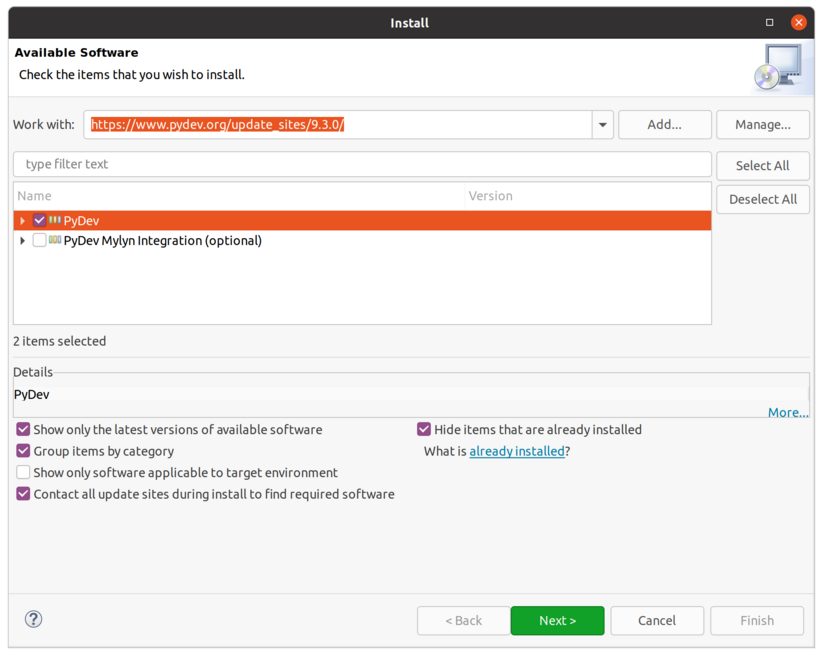
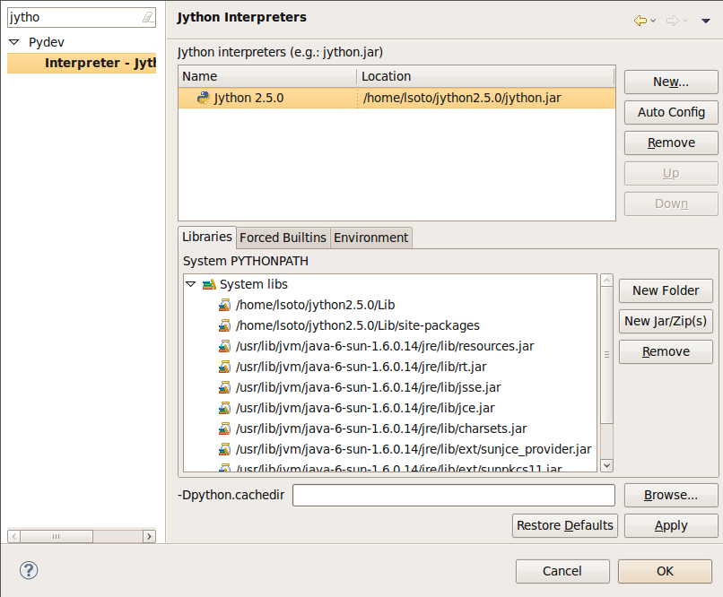
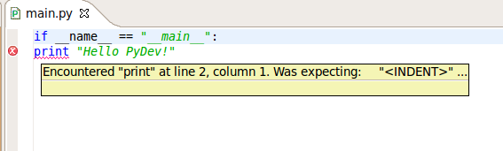
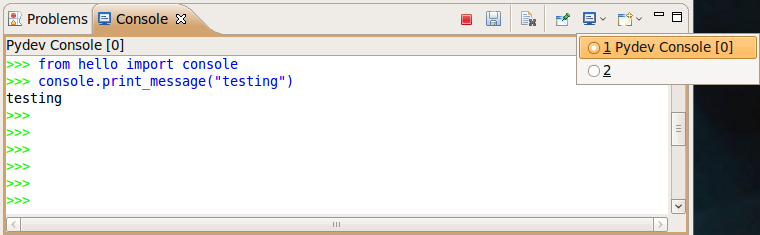
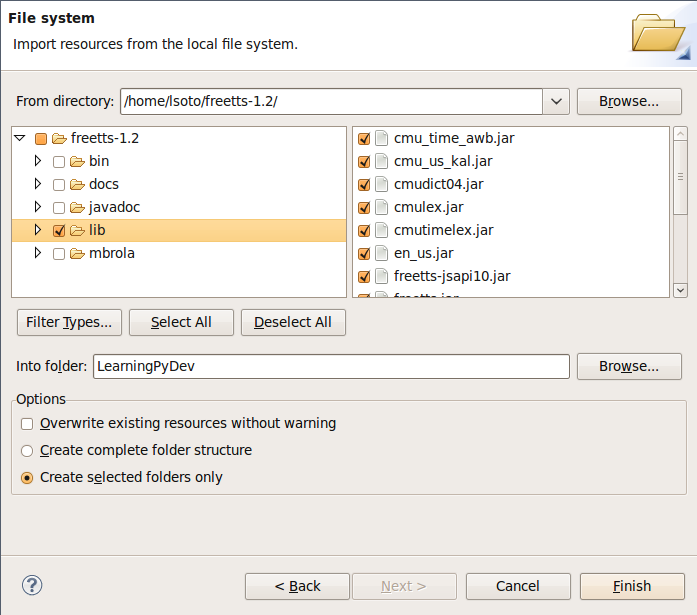
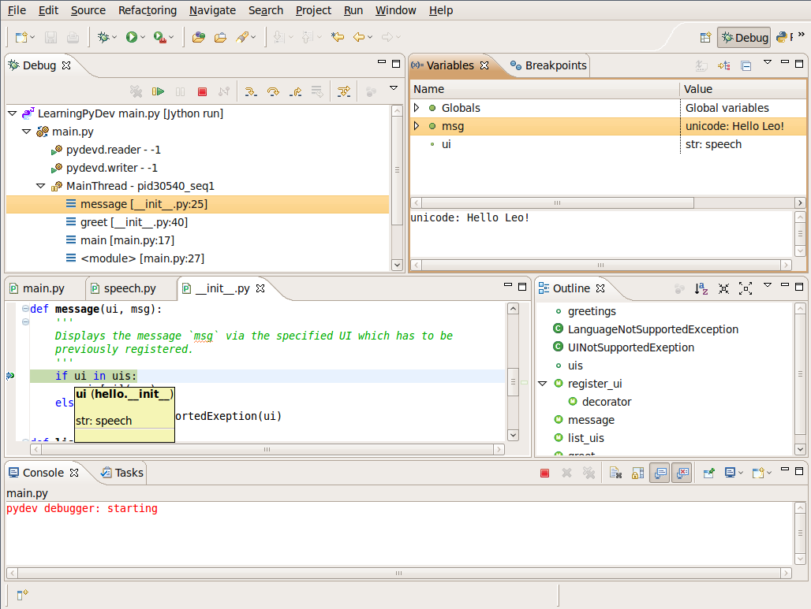

Chapter 11: Using Jython in an IDE
+++++++++++++++++++++++++++++++++++

In this chapter, we will discuss developing Jython applications using two of the most popular integrated development environments, Eclipse and Netbeans.  There are many other development environments available for Python and Jython today, however, these two are perhaps the most popular and contain the most Jython-specific tools.  Eclipse has had a plugin known as PyDev for a number of years, and this plugin provides rich support for developing and maintaining Python and Jython applications alike.  More recently, an Eclipse plugin for Django has been developed by Leo Soto and it is a one-of-a-kind development tool offering Jython developers the chance to easily develop Django web applications with Eclipse.  Netbeans began to include Python and Jython support with version 6.5 and beyond.  The Netbeans IDE also provides rich support for development and maintenance of Python and Jython applications.  There is not a Django plugin available for this IDE at the time of this writing, although there most likely will be one in the works very soon.

Please note that in this chapter we will refer to Python/Jython as Jython.  All of the IDE options discussed are available for both Python and Jython unless otherwise noted.  For readability and consistency sake, we’ll not refer to both Python and Jython throughout this chapter unless there is some feature that is not available for Python or Jython specifically.  Also note that we will call the plugins discussed by their names, so in the case of Netbeans the plugin is called *Netbeans Python Plugin*.  This plugin works with both Python and Jython in all cases.

Eclipse
=======

Naturally, you will need to have Eclipse installed on your machine to use Jython
with it. The latest available version when this book is being written is
Eclipse 3.5 (also known as Eclipse Galileo) and it is the recommended version to
use to follow this section . Versions 3.2, 3.3 and 3.4 will work too, although
there will be minor user interface differences which may confuse you while
following this section.

If you don't have Eclipse installed on your machine, go to
http://www.eclipse.org/downloads/ and download the version for Java
developers.

Installing PyDev
----------------

Eclipse doesn't include Jython support built-in. Thus, we will use PyDev, an
excellent plugin which adds support for the Python language and includes
specialized support for Jython. PyDev's home page is
http://pydev.sourceforge.net/ but you won't need to manually download and
install it.

To install the plugin, start Eclipse and go to the menu :menuselection:`Help -->
Install new Software...`, type http://pydev.sourceforge.net/updates/ into the
"Work with" input box and press enter. After a short moment you will see an
entry for PyDev in the bigger box below. Just select it, clicking on the
checkbox which appears at the left of "PyDev" (see the image which follows, as
reference) and finally click the "Next" button.

After this, just follow the wizard, accept the license agreement and then click
the "Finish" button.

Once the plugin has been installed by Eclipse, you will be asked if you want to
restart the IDE to enable the plugin. As that is the recommended option, do so,
answering "Yes" to the dialog. Once Eclipse reboots itself, you will enjoy
full Python support on the IDE.

Minimal Configuration
---------------------

Before starting a PyDev project you must tell PyDev which Python interpreters
are available. In this context, a interpreter is just a particular installation
of some implementation of Python. When starting you will normally only need one
interpreter and for this chapter we will only use Jython 2.5.0. To configure it,
open the Eclipse Preferences dialog (via :menuselection:`Window --> Preferences`
in the main menu bar). On the text box located at the top of the left panel,
type "Jython". This will filter the myriad of Eclipse (and PyDev!) options and
will present us with a much simplified view, in which you will spot the
"Interpreter - Jython" section on the left.

Once you selected the "Intepreter - Jython" section, you will be presented with
an empty list of Jython intepreters at the top of the right side. We clearly
need to fix that! So, click the "New..." button, enter "Jython 2.5.0" as the
"Interpreter Name", click the "Browse..." button and find the ``jython.jar``
inside your Jython 2.5.0 installation.

.. note:: 

   Even if this is the only runtime we will use on this chapter, I recommend you
   to use a naming schema like the one proposed here, including both the
   implementation name (e.g.: "Jython") and the full version (e.g.: "2.5.0") on
   the interpreter name. This will avoid confusion and name clashing when adding
   new interpreters in the future.

After selecting the ``jython.jar`` file, PyDev will automatically detect the default,
*global* ``sys.path`` entries. PyDev always infer the right values, so unless
you have very special needs, just accept the default selection and click "OK".

If all has gone well, you will now see an entry on the list of Jython
interpreters, representing the information you just entered. It will be similar
to the following picture (of course, your filesystem paths will differ):

That's all. Click "OK" and you will be ready to develop with Jython while
enjoying the support provided by a modern IDE.

If you are curious, you may want to explore the other options found on the
"Preferences" window, below the "PyDev" section (after clearing the search
filter we used to quickly go to the Jython interpreter configuration). But in my
experience, it's rarely needed to change most of the other options available.

In the next sections we will take a look to the more important PyDev features to
have a more pleasant learning experience and make you more productive.

Hello PyDev!: Creating Projects and Executing Modules
-----------------------------------------------------

Once you see the first piece of example code on this chapter, it may seem
over simplistic. It is, indeed, a very dumb example. The point is to keep the
focus on the basic steps you will perform for the lifecycle of any Python-based
project inside the Eclipse IDE, and which will apply on simple and complex
projects.  So, as you probably guessed it, our first project will be a dumb
"Hello World". Let's start it!

Go to :menuselection:`File --> New --> Project...`. You will be presented with a
potentially long list with all the kind of projects you can create with
Eclipse. Select "PyDev Project", under the "PyDev" group (you can also use the
filter text box at the top and just type "PyDev Project" if it's faster for you).

The next dialog will ask you for your project properties. As the "Project name",
we will use "LearningPyDev". On "Project contents", we will let checked the "Use
default" checkbox, so PyDev will create a directory with the same name as the
project inside the Eclipse workspace (which is the root path of your eclipse
projects). Since we are using Jython 2.5.0, we will change the "Project type" to
"Jython" and the "Grammar Version" to "2.5". We will let alone the
"Interpreter", which will default to the Jython interpreter we just defined on
the `Minimal Configuration`_ section. We will also left checked the "Create
default 'src' folder and add it to the pythonpath" option since it's a common
convention on Eclipse projects. 

After clicking "Finish" PyDev will create your project, which will only contain
an empty ``src`` directory and a reference to the interpreter being used. Let's
create our program now!

Right click on the project, and select :menuselection:`New --> PyDev
Module`. Let the "Package" blank and enter "main" as the "Name". PyDev offers
some templates to speed up the creation of new modules, but we won't use them,
as our needs are rather humble. So let the "Template" as empty and click
"Finish". 

PyDev will present you an editor for the ``main.py`` file it just created.
It's time to implement our program. Write the following code at the editor::

    if __name__ == "__main__":
        print "Hello PyDev!"

And then press ``Ctrl + F11`` to run this program. Select "Jython Run" from the
dialog presented and click OK. The program will run and the text "Hello PyDev!"
will appear on the console, located on the bottom area of the IDE.

If you manually typed the program, you probably noted that the IDE knows that in
Python a line ending in ":" marks the start of a block and will automatically
put your cursor at the appropriate level of indentation in the next line. See
what happens if you manually override this decision and put the print statement
at the same indentation level of the if statement and save the file. The IDE
will highlight the line flagging the error. If you hover at the error mark, you
will see the explanation of the error, as seen in the image:

Expect the same kind of feedback for whatever syntax error you made. It helps to
avoid the frustration of going on edit-run loops only to find further minor
syntax errors. 

Passing Command-line Arguments and Customizing Execution
--------------------------------------------------------

Command line arguments may seem old-fashioned, but are actually a very simple
and effective way to let programs interact with the outside. Since you have
learned to use Jython as a scripting language, it won't be uncommon to write
scripts which will take its input from the command line (note that for
unattended execution, reading input from the command line is way more convenient
that obtaining data from the standard input, let alone using a GUI).

As you have probably guessed, we will make our toy program to take a command
line argument. The argument will represent the name of the user to greet, to
build a more personalized solution. Here is how our main.py should look like::
    
    import sys
    if __name__ = "__main__":
        if len(sys.argv) < 2:
            print "Sorry, I can't greet you if you don't say your name"
        else: 
            print "Hello %s!" % sys.argv[1]

If you hit ``Ctrl + F11`` again, you will see the "Sorry I can't greet you..."
message on the console. It makes sense, since you didn't pass the name. Not to
say that it was your fault, as you didn't have any chance to say your name
either.

To specify command line arguments, go to the :menuselection:`Run --> Run
Configurations...` menu, and you will find an entry named "LearningPyDev
main.py" under the "Jython Run" section in the left. It will probably be already
selected, but if it's not, select it manually. Then, on the main section of the
dialog you will find ways to customize the execution of our script. You can
change aspects like the current directory, pass special argument to the JVM,
change the interpreter to use, set environment variables, among others. We just
need to specify an argument so let's type "Bob" on the "Program arguments" box
and click the "Run" button. 

As you'd expect, the program now prints "Hello Bob!" on the console. Note that
the value you entered is remembered, that is, if you press ``Ctrl + F11`` now,
the program will print "Hello Bob!" again. Some people may point out that this
behavior makes testing this kind of programs very awkward, since the "Run
Configurations" dialog will have to be opened each time the arguments need to be
changed. But if we really want to test our programs (which *is* a good idea), we
should do it in the right way. We will look into that soon, but first lets
finish our tour on basic IDE features.

Playing with the Editor
-----------------------

Let's extend our example code a bit more. providing different ways to greet our
users, in different languages. We will use the ``optparse`` to process the
arguments this time. Refer to Chapter 8 if you want to remember how to use
``optparse``. We will also use decorators (seen in Chapter 6) to make it trivial
to extend our program with new ways to greet our users. So, our little
``main.py`` has grown a bit now::
    
    # -*- coding: utf-8 -*-
    import sys
    from optparse import OptionParser
    
    greetings = dict(en=u'Hello %s!',
                     es=u'Hola %s!',
                     fr=u'Bonjour %s!',
                     pt=u'Alò %s!')
    
    uis = {}
    def register_ui(ui_name):
        def decorator(f):
            uis[ui_name] = f
            return f
        return decorator
    
    def message(ui, msg):
        if ui in uis:
            uis[ui](msg)
        else:
            raise ValueError("No greeter named %s" % ui)
        
    def list_uis():
        return uis.keys()
    
    @register_ui('console')
    def print_message(msg):
        print msg
    
    @register_ui('window')
    def show_message_as_window(msg):
        from javax.swing import JFrame, JLabel
        frame = JFrame(msg,
                       defaultCloseOperation=JFrame.EXIT_ON_CLOSE,
                       size=(100, 100),
                       visible=True)
        frame.contentPane.add(JLabel(msg))
            
    if __name__ == "__main__":
        parser = OptionParser()
        parser.add_option('--ui', dest='ui', default='console', 
                          help="Sets the UI to use to greet the user. One of: %s" %
                          ", ".join("'%s'" % ui for ui in list_uis()))
        parser.add_option('--lang', dest='lang', default='en',
                          help="Sets the language to use")
        options, args = parser.parse_args(sys.argv)
        if len(args) < 2:        
            print "Sorry, I can't greet you if you don't say your name"
            sys.exit(1)
        
        if options.lang not in greetings:
            print "Sorry, I don't speak '%s'" % options.lang
            sys.exit(1)
        
        msg = greetings[options.lang] % args[1] 
        
        try:
            message(options.ui, msg)
        except ValueError, e:
            print "Invalid UI name\n"    
            print "Valid UIs:\n\n" + "\n".join(' * ' + ui for ui in list_uis())
	    sys.exit(1)

    
Take a little time to play with this code in the editor. Try pressing ``Ctrl +
Space``, which is the shortcut for automatic code completion (also known as
"Intellisense" on Microsoft's parlance) on different locations. It will provide
completion for import statements (try completing that line just after the
``import`` token, or in the middle of the ``OptionParser`` token) and attribute
or method access (like on ``sys.exit`` or ``parser.add_option`` or even in
``JFrame.EXIT_ON_CLOSE`` which is accessing a Java class! ). It also provides
hints about the parameters in the case of methods. 

In general, every time you type a dot, the automatic completion list will pop
out, if the IDE knows enough about the symbol you just typed to provide
help. But you can also call for help at any given point. For example, go to the
bottom of the code and type ``message(``. Suppose you just forgot the order of
the parameters to that function. Solution: Press ``Ctrl + Space`` and PyDev will
"complete" the statement, using the name of the formal parameters of the
function. 

Also try ``Ctrl + Space`` on keywords like ``def``. PyDev will provide you
little templates which may save you some typing. You can customize the templates
on the :menuselection:`PyDev --> Editor --> Templates` section of the Eclipse
Preferences window (available on the :menuselection:`Window --> Preferences`
main menu).

The other thing you may have noted now that we have a more sizable program with
some imports, functions and global variables is the "Outline" panel in the
right side of the IDE window shows a tree-structure view of code being
edited showing such features. It also displays classes, by the way.

And don't forget to run the code! Of course, it's not much spectacular to see
that after pressing ``Ctrl + F11`` we still get the same boring "Hello Bob!"
text on the console. But if you edit the command line argument (as seen
recently, via the "Run Configurations..." dialog) to the following: ``Bob --lang
es --ui window``, you will get a nice window greeting Bob in Spanish. Also see
what happens if you specify a non supported UI (say, ``--ui speech``) or a
unsupported language. We even support the  ``--help``! So we have a generic,
polyglot greeter which also happens to be reasonably robust and user friendly
(for command line program standards, that is). 

At this point you are probably tired of manually testing the program editing the
command line argument on that dialog. Just one more extra section and we will
get into a better way to test our program using the IDE. Actually, part of the
next section will help us towards the solution.

A Bit of Structure: Packages, Modules and Navigation
----------------------------------------------------

If you like simplicity you may be asking (or swearing, depending on your
character) why I over-engineered the last example. There are simpler (in the
sense of a more concise and understandable code) solutions to the same problem
statement. But I needed to grow the our toy code to explore another aspect of
IDEs, which for some people are a big reason to use them: Organizing complex
code bases. And you don't expect me to put a full blown Pet Store example on
this book to get to that point, do you?  ;-)

So, let's suppose that the complications I introduced (mainly the
registry of UIs exposed via decorators) are perfectly justified, because we are
working on a slightly complicated problem. In other words: Let's extrapolate.

The point is, we know that the great majority of our projects can't be confined
to just one file (i.e, one python module). Even our very dumb example is
starting to get unpleasant to read. And, when we realize that we need more than
one module, we also realize we need to group our modules under a common
umbrella, to keep it clear that our modules form a coherent thing together and
to lower the chances of name clashing with other projects. So, as seen on
Chapter 7, the Python solution to this problem are modules and packages.

Our plan is to organize the code as follows. Everything will go under the
package ``hello``. The core logic, including the language support, will go into the
package itself (i.e, into its ``__init__.py`` file) and each UI will go into its
own module under the ``hello`` package. The ``main.py`` script will remain as the
command line entry point.

Right click on the project and select :menuselection:`New --> PyDev
Package`. Enter "hello" as the "Name" and click "Finish". PyDev will create the
package and open an editor for its ``__init.py__`` file. As I said, we will move
the core logic to this package, so this file will contain the following code,
extracted from our previous version of the main code::

    # -*- coding: utf-8 -*-
    greetings = dict(en=u'Hello %s!',
                     es=u'Hola %s!',
                     fr=u'Bonjour %s!',
                     pt=u'Alò %s!')
    
    class LanguageNotSupportedException(ValueError): 
        pass
    
    class UINotSupportedExeption(ValueError):
        pass
    
    uis = {}
    def register_ui(ui_name):
        def decorator(f):
            uis[ui_name] = f
            return f
        return decorator
    
    def message(ui, msg):
        '''
        Displays the message `msg` via the specified UI which has to be
	previously registered.
        '''
        if ui in uis:
            uis[ui](msg)
        else:
            raise UINotSupportedExeption(ui)
        
    def list_uis():
        return uis.keys()
    
    def greet(name, lang, ui):
        '''
        Greets the person called `name` using the language `lang` via the 
        specified UI which has to be previously registered.
        '''
        if lang not in greetings:
            raise LanguageNotSupportedException(lang)
        message(ui, greetings[lang] % name)
    
Note that I embraced the idea of modularizing our code, providing exceptions to
notify clients of problems when calling the greeter, instead of directly
printing messages on the standard output. 

Now we will create the ``hello.console`` module containing the console UI. Right
click on the project, select :menuselection:`New --> PyDev Module`, Enter
"hello" as the "Package" and "console" as the "Name". You can avoid to type the
package name if you right click on the package instead of the project. Click
"Finish" and copy the ``print_message`` function there::

    from hello import register_ui
    
    @register_ui('console')
    def print_message(msg):
        print msg

Likewise, create the ``window`` module inside the ``hello`` package, and put there the code for
``show_message_as_window``::

    from javax.swing import JFrame, JLabel
    from hello import register_ui

    @register_ui('window')
    def show_message_as_window(msg):
        frame = JFrame(msg,
                       defaultCloseOperation=JFrame.EXIT_ON_CLOSE,
                       size=(100, 100),
                       visible=True)
        frame.contentPane.add(JLabel(msg))
        
Finally, the code for our old ``main.py`` is slightly reshaped into the
following::

    import sys
    import hello, hello.console, hello.window 
    from optparse import OptionParser
            
    def main(args):
        parser = OptionParser()
        parser.add_option('--ui', dest='ui', default='console', 
                          help="Sets the UI to use to greet the user. One of: %s" %
                          ", ".join("'%s'" % ui for ui in list_uis()))
        parser.add_option('--lang', dest='lang', default='en',
                          help="Sets the language to use")
        options, args = parser.parse_args(args)
        if len(args) < 2:        
            print "Sorry, I can't greet you if you don't say your name"
            return 1    
        try:
            hello.greet(args[1], options.lang, options.ui)        
        except hello.LanguageNotSupportedException:
            print "Sorry, I don't speak '%s'" % options.lang
            return 1
        except hello.UINotSupportedExeption:
            print "Invalid UI name\n"    
            print "Valid UIs:\n\n" + "\n".join(' * ' + ui for ui in hello.list_uis())
            return 1
        return 0
        
    if __name__ == "__main__":
        main(sys.argv)

.. tip:: 

   Until now, we have used PyDev's wizards to create new modules and
   packages. But, as you saw on Chapter 7, modules are just files with the
   ``.py`` extension located on the ``sys.path`` or inside packages, and
   packages are just directories that happen to contain a ``__init__.py``
   file. So you may want to create modules using :menuselection:`New --> File`
   and packages using :menuselection:`New --> Folder` if you don't like the
   wizards.

Now we have our code split over many files. On a small project navigating
through it using the left-side project tree (called the "PyDev Package
Explorer") isn't difficult, but you can imagine that on a project with dozens of
files it will be difficult. So we will see some ways to ease the navigation of a
code base.

First, let's suppose you are reading ``main.py`` and want to jump to the
definition of the ``hello.greet`` function, called on the line 17. Instead of
manually changing to such file and scanning until finding the function, just
press ``Ctrl`` and click ``greet``. PyDev will automatically move you into the
definition. Also works on most variables and modules (try it on the import
statements, for example). 

Another good way to quickly jump between files without having to resort to the
Package Explorer is to use ``Ctrl + Shift + R``, which is the shortcut for "Open
Resource". Just type (part of) the file name you want to jump to and PyDev will
search on every package and directory of your open projects.

Finally, the IDE internally records an history of your "jumps" between files,
just like a web browser do for web pages you visit. And just like a web browser
you can go back and forward. To do this, use the appropriate button on the
toolbar or the default shortcuts which are ``Ctrl + Left`` and ``Ctrl + Right``.

Testing
-------

OK, it's about time to explore our options to test our code, without resorting
to the cumbersome manual black box testing we have been done changing the
command line argument and observing the output.

PyDev supports running PyUnit tests from the IDE, so we will write them. Let's
create a module named ``tests`` on the ``hello`` package with the following
code::

    import unittest
    import hello
    
    class UIMock(object):
        def __init__(self):
            self.msgs = []
        def __call__(self, msg):
            self.msgs.append(msg)    
    
    class TestUIs(unittest.TestCase):
        def setUp(self):
            global hello
            hello = reload(hello)
            self.foo = UIMock()
            self.bar = UIMock()
            hello.register_ui('foo')(self.foo)    
            hello.register_ui('bar')(self.bar)
            hello.message('foo', "message using the foo UI")
            hello.message('foo', "another message using foo")
            hello.message('bar', "message using the bar UI")
        
        def testBarMessages(self):
            self.assertEqual(["message using the bar UI"], self.bar.msgs) 
        
        def testFooMessages(self):
            self.assertEqual(["message using the foo UI", 
                              "another message using foo"],
                              self.foo.msgs)    
        def testNonExistentUI(self):
            self.assertRaises(hello.UINotSupportedExeption, 
                              hello.message, 'non-existent-ui', 'msg')
    
        def testListUIs(self):
            uis = hello.list_uis()
            self.assertEqual(2, len(uis))
            self.assert_('foo' in uis)
            self.assert_('bar' in uis)
    
As you can see, the test covers the functionality of the dispatching of messages
to different UIs. A nice feature of PyDev is the automatic discovery of tests,
so you don't need to code anything else to run the tests above. Just right click
on the ``src`` folder on the Package Explorer and select :menuselection:`Run As
--> Jython unit-test`. You will see the output of the test almost immediately on
the console::

    Finding files...
    ['/home/lsoto/eclipse3.5/workspace-jythonbook/LearningPyDev/src/'] ... done
    Importing test modules ... done.
    
    testBarMessages (hello.tests.TestUIs) ... ok
    testFooMessages (hello.tests.TestUIs) ... ok
    testListUIs (hello.tests.TestUIs) ... ok
    testNonExistentUI (hello.tests.TestUIs) ... ok
    
    ----------------------------------------------------------------------
    Ran 4 tests in 0.064s
    
    OK

Python's unittest is not the only testing option on the Python world. A
convenient way to do tests which are more black-box-like than unit test, though
equally automated is doctest. 

.. note::

   We will cover testing tools in much greater detail in Chapter 19, so take a look
   at that chapter if you feel too disoriented.

The nice thing about doctests is that they look like a interactive session with
the interpreter, which makes them quite legible and easy to create. We will test
our console module using a doctest.

First, click the rightmost button on the console's toolbar (you will recognize
it as the one with a plus sign on its upper left corner, which has the "Open
Console" tip when you pass the mouse over it). From the menu, select "PyDev
Console". To the next dialog answer "Jython Console". After doing this you will
get an interactive interpreter embedded on the IDE.

Let's start exploring our own code using the interpreter::

     >>> from hello import console
     >>> console.print_message("testing")
     testing

I highly encourage you to type those two commands yourself. You will note how
code completion also works on the interactive interpreter!

Back to the topic, we just interactively checked that our console module works
as expected. The cool thing is that we can copy and paste this very snippet as a
doctest which will serve to automatically check that the behavior we just tested
will stay the same in the future. 

Create a module named ``doctests`` inside the ``hello`` package, and paste those
three lines from the interactive console, surrounding them by triple quotes
(since they are not syntactically correct python code after all). After adding a
little of boilerplate to make this file executable, it will look like this::

    """
    >>> from hello import console
    >>> console.print_message("testing")
    testing
    """
    
    if __name__ == "__main__":
        import doctest
        doctest.testmod(verbose=True)

After doing this, you can run this test via the :menuselection:`Run --> Jython
run` menu while ``doctests.py`` is the currently active file on the editor.  If
all goes well, you will get the following output::

    Trying:
        from hello import console
    Expecting nothing
    ok
    Trying:
        console.print_message("testing")
    Expecting:
        testing
    ok
    1 items passed all tests:
       2 tests in __main__
    2 tests in 1 items.
    2 passed and 0 failed.
    Test passed.

After running the doctest you will notice that your interactive console has gone
away, replaced by the output console showing the test results. To go back to the
interactive console, look for the console button in the console tab toolbar, exactly
at the left of the button you used to spawn the console, Then, on the dropdown
menu select the "PyDev Console" as shown in the next image.

As you can see, you can use the interactive console to play with your code, try
ideas and test them. And later a simple test can be made just by copying and
pasting text from the same interactive console session. Of special interest is
the fact that, since Jython code can access Java APIs quite easily, you can also
test classes written with Java in this way!

Adding Java libraries to the project
------------------------------------

Finally, I will show you how to integrate Java libraries into your
project. I said some pages ago that we could add a "speech" interface for our
greeter. It doesn't sound like a bad idea after all, since (like on almost any
aspect) the Java world has good libraries to solve that problem.

We will use the FreeTTS library, which can be downloaded from
http://freetts.sourceforge.net/docs/index.php. (You should download the binary
version)

After downloading FreeTTS you will have to extract the archive on some place on
your hard disk. Then, we will import a JAR file from FreeTTS into our PyDev
project.

Right click the project and select "Import...". Then choose
:menuselection:`General --> File System` and browse to the directory in which
you expanded FreeTTS and select it.  Finally, expand the directory on the left
side panel and check the ``lib`` subdirectory. See the following image as
reference.

After clicking finish you will see that the file is now part of your project. 

.. tip:: 

   Alternatively, and depending on your operating system, the same operation can
   be performed copying the file from the file manager and pasting it into the
   project (either via menu, keyboard shortcuts or drag & drop).

Now, the file is part of the project, but we need to tell PyDev that the file is
a JAR file and should be added to the ``sys.path`` of our project
environment. To do this right click on the project and select "Properties". Then
on the left panel of the dialog select "PyDev - PYTHONPATH". Then click the "Add
zip/jar/egg" button and select the ``lib/freetts.jar`` file on the right side of the
dialog that will pop out. Click OK on both dialogs and you are ready to use this
library from Python code.

The code for our new ``hello.speech`` module is as follows::

    from com.sun.speech.freetts import VoiceManager
    from hello import register_ui
    
    @register_ui('speech')
    def speech_message(msg):
        voice = VoiceManager().getVoice("kevin16")
        voice.allocate()
        voice.speak(msg)
        voice.deallocate()

If you play with the code on the editor you will notice that PyDev also provides
completion for imports statement referencing the Java library we are using.

Finally, we will change the second line of ``main.py`` from::

    import hello, hello.console, hello.window 

to::

    import hello, hello.console, hello.window, hello.speech

In order to load the speech UI too. Feel free to power on the speakers and let
the computer greet yourself and your friends!

There you go, our humble greeter has finally evolved into a quite interesting,
portable program with speech synthesis abilities. It's still a toy, but one
which shows how quick you can move with the power of Jython, the diversity of
Java and the help of an IDE.

Other topics
------------

I have covered most of the PyDev features, but I've left a few unexplored. We
will take a look at what we've missed before ending this half-chapter dedicated
to PyDev.

Debugging
~~~~~~~~~

PyDev offers full debugging abilities for your Jython code. To try it just put
some breakpoints on your code double clicking on the left margin of the
editor, and then start your program using the ``F11`` shortcut instead of
``Ctrl + F11``. 

Once the debugger hits your breakpoint, the IDE will ask you to change its
perspective. It means that it will change to a different layout, better suited
for debugging activities. Answer yes to such dialog and you will find yourself
on the debugging perspective which looks like the following image:

In few words, the perspective offers the typical elements of a debugger: the
call stack, the variables for each frame of the call stack, a list of
breakpoints, and the ability to "Step Into" (``F5``), "Step Over" (``F6``) and
"Resume Execution" (``F8``) among others.

Once you finish your debugging session, you can go back to the normal editing
perspective by selecting "PyDev" on the upper right area of the main IDE Window
(which will have the "Debug" button pushed while staying in the debugging
perspective).

Refactoring
~~~~~~~~~~~

PyDev also offers some basic refactoring abilities. Some of them are limited to
CPython, but others, like "Extract Method" work just fine with Jython
projects. I encourage you to try them to see if they fit your way of
work. Sometimes you may prefer to refactor manually since the task tend do not
be as painful as in Java (or any other statically typed language without type
inference). On the other hand, when the IDE can do the right thing for you and
avoid some mechanical work, you will be more productive.
  
(Half-)Conclusion
-----------------

PyDev is a very mature plugin for the Eclipse platform which can be an important
element in your toolbox. Automatic completion ans suggestions helps a lot when
learning new APIs (both Python APIs and Java APIs!) specially if paired with the
interactive console. It is also a good way to introduce a whole team into Jython
or into an specific Jython project, since the project-level configuration can be
shared via normal source control system. Not to mention that programmers coming
from the Java world will find themselves much more comfortable on a familiar
environment.

To me, IDEs are a useful part of my toolbox, and tend to shine on big codebases
and/or complex code which I don't completely understand yet. Powerful navigation
and refactoring abilities are key on the process of understanding such kind of
projects and are features that should only improve in the future.

Finally, the debugging capabilities of PyDev are superb and will end your days
of using ``print`` as a poor man's debugger (Seriously, I did that for a
while!). Even more advanced Python users who master the art of ``import pdb;
pdb.set_trace()`` should give it a try.

Now, this is a "half-conclusion" because PyDev isn't the only IDE available for
Jython. If you are already using the Netbeans IDE or didn't like Eclipse or
PyDev for some reason, take a look at the rest of this chapter in which we will
cover the Netbeans plugin for Python development.
    
Netbeans 
========

The Netbeans integrated development environment has been serving the Java community well for over ten years now.  During that time, the tool has matured quite a bit from what began as an ordinary Java development tool into what is today an advanced development and testing environment for Java and other languages alike.  As Java and JavaEE application development still remain an integral part of the tool, other languages such as JRuby, Jython, Groovy, and Scala have earned themselves a niche in the tool as well.  Most of these languages are supported as plugins to the core development environment, which is what makes Netbeans such an easy IDE to extend as it is very easy to build additional features to distribute.  The Python support within Netbeans began as a small plugin known as nbPython, but it has grown into a fully-featured Python development environment and it continues to grow.

The Netbeans Python support provides developers with all of the expected IDE features such as code completion, color coding, and easy runtime development.  It also includes some nice advanced features for debugging applications and the like.  

IDE Installations and Configurations
====================================

The first step for installing the Netbeans Python development environment is to download the current release of the Netbeans IDE.  At the time of this writing, Netbeans 6.7 was the most recent release, hot off the presses in fact.  You can find the IDE download by going to the website http://www.netbeans.org and clicking on the download link.  Once you do so, you’ll be presented with plenty of different download options.  These are variations of the IDE that are focused on providing different features for developers depending upon what they will use the most.  Nobody wants a bulky, memory hungry development tool that will overhaul a computer to the extreme.  By providing several different configuration of the IDE, Netbeans gives you the option to leave off the extras and only install those pieces that are essential to your development.  The different flavors for the IDE include Java SE, Java, Ruby, C/C++, PHP, and All.  For those developers only interested in developing core Java applications, the Java SE download would suffice.  Likewise, someone interested in any of the other languages could download the IDE configuration specific to that language.  For the purposes of this book and in my everyday development, I use the “All” option as I enjoy having all of the options available.  However, there are options available for adding features if you download only the Java SE or another low-profile build and wish to add more later.

At the time of this writing, there was also a link near the top of the downloads page for PythonEA distribution.  If that link or a similar Python Netbeans distribution link is available then you can use it to download and install just the Jython-specific features of the Netbeans IDE.  I definitely do not recommend taking this approach unless you plan to purely code Jython applications alone.  It seems to me that a large population of the Jython developer community also codes some Java, and may even integrate Java and Jython within their applications.  If this is the case, you will want to have the Java-specific features of Netbeans available as well.  That is why I do not recommend the Python-only distribution for Jython developers, but the choice is there for you to make.

Now that you’ve obtained the IDE, it is easy to install in any environment using the intuitive Netbeans installer.  Perhaps the most daunting task when using a new IDE is configuring it for your needs.  This should not be the case with Netbeans though because the configuration for Java and Python alike are quite simple.  For instance, if you working with the fully-featured installation, you will already have application servers available for use as Netbeans installs Glassfish by default.  Note that it is a smart idea to change that admin password very soon after installation in order to avoid any potentially embarrassing security issues.

When the IDE initially opens up, you are presented with a main window that includes links to blogs and articles pertaining to Netbeans features.  You also have the standard menu items available such as File, Edit, Tools, and so on.  In this chapter we will specifically cover the configuration and use of the Jython features, however, there are very useful tutorials available online and in book format for covering other Netbeans features.  One thing you should note at this point is that with the initial installation, Python/Jython development tools are not yet installed unless you chose to install the *PythonEA* distribution.  Assuming that you have installed the full Netbeans distribution, you will need to add the Python plugin via the Netbeans plugin center.  You will need to go to the *Tools* menu and then open the *Plugins *submenu.  From there, you should choose the *Available Plugins* tab and sort by category.  Select all of the plugins in the *Python* category and then install.  This option will install the Python plugin as well as a distribution of Jython.  You will need to follow on-screen directions to complete the installation.

Once the plugin has been successfully installed then it is time to configure your Python and Jython homes.  To do so, go to the *Tools* menu and then open the *Python Platforms* menu as this will open the platform manager for Python/Jython.  At the time of this writing, the default Jython version that was installed with the Python plugin was 2.5b0+, even though 2.5.0 final has been release.  As this is the case, go ahead and add your Jython 2.5.0 final installation as a platform option and make it the default.  To do so, click on the *New* button underneath the platform listing.  You can try to select the *Auto Detect* option, but I did not have luck with Netbeans finding my Jython installation for 2.5.0 final using it.  If you choose the *New* button then you will be presented with a file chooser window.  You should choose the Jython executable that resides in the area <JYTHON_HOME>/bin and all of the other necessary fields will auto-populate with the correct values.  Once completed, choose the *Close* button near the bottom of the *Python Platform Manager* window.  You are now ready to start programming with Python and Jython in Netbeans.

Advanced Python Options
=======================

If you enter the Netbeans preferences window then you will find some more advanced options for customizing your Python plugin.  If you go to the *Editor* tab, you can set up Python specific options for formatting, code templates, and hints.  In doing so, you can completely customize the way that Netbeans displays code and offers assistance when working with Jython.  You can also choose to set up different fonts and coloring for Python code by selecting the *Fonts and Colors* tab.  This is one example of just how customizable Netbeans really is because you can set up different fonts and colors for each language type.

If you choose the *Miscellaneous* tab then you can add different file types to the Netbeans IDE and associate them with different IDE features.  If you look through the pull-down menu of files, you can see that files with the extension of *py* or *pyc* are associated as Python files.  This ensures that files with the associated extensions will make use of their designated Netbeans features.  For instance, if we wanted to designate our Jython files with the extension of *jy*, we could easily do so and associate this extension with Python files in Netbeans.  Once we’ve made this association then we can create files with an extension of *jy* and use them within Netbeans just as if they were Python files.  Lastly, you can alter a few basic options such as enabling prompting for python program arguments, and changing debugger port and shell colors from the *Python* tab in Netbeans preferences.  

General Jython Usage
====================

As stated previously in the chapter, there are a number of options when using the Netbeans Python solution.  There are a few different selections that can be made when creating a new Jython project.  You can either choose to create a *Python Project* or *Python Project with Existing Sources*.  These two project types are named quite appropriately as a *Python Project* will create an empty project, and

Once created it is easy to develop and maintain applications and scripts alike.  Moreover, you can debug your application and have Netbeans create tests if you choose to do so.  One of the first nice features you will notice is the syntax coloring in the editor.  

Stand Alone Jython Apps
=======================

In this section, I will discuss how to develop a stand-alone Jython application within Netbeans.  We will use a variation of the standard *HockeyRoster* application that I have used in other places throughtout the book.  Overall, the development of a stand alone Jython application in Netbeans differs very little from a stand alone Java application.  The main difference is that you will have different project properties and other options available that pertain to creating Jython.  And obviously you will be developing in Jython source files along with all of the color coding and code completion that the Python plugin has to offer.

To get started, go ahead and create a new Python Project by using the *File* menu or the shortcut in the Netbeans toolbar.  For the purposes of this section, name the new project *HockeyRoster*.  Uncheck the option to *Create Main File* as we will do this manually.  Once your project has been created, explore some of the options you have available by right-clicking (ctrl-click) on the project name.  The resulting menu should allow you the option to create new files, run, debug, or test your application, build eggs, work with code coverage, and more.  At this point you can also change the view of your Python packages within Netbeans by choosing the *View Python Packages as* option.  This will allow you the option to either see the application in *list* or *tree* mode, your preference.  You can search through your code using the *Find* option, share it on Kenai with the integrated Netbeans Kenai support, look at the local file history, or use your code with a version control system.  Click on the *Properties* option and the *Project Properties* window should appear.  From within the *Project Properties* window, there are options listed on the left-hand side including *Source*, *Python*, *Run*, and *Formatting*.  The *Source* option provides the ability to change source location or add new source locations to your project.  The *Test Root Folders* section within this option allows you to add a location where Python tests reside so that you can use them with your project.  The *Python* option allows you to change your Python platform and add locations, JARs, and files to your Python path.  Changing your Python platform provides a handy ability to test your program on Jython and Python alike, if you want to ensure that your code works on each platform.  The *Run* option provides the ability to add or change the *Main* module, and add application arguments.  Lastly, the *Formatting* option allows you to specify different formatting options in Netbeans for this particular project.  This is great because each different project can have different colored text, etc. depending upon the options chosen.

At this point, create the *Main* module for the *HockeyRoster* application by using the *File* and then *New* drop-down menu, right-clicking (cntrl-click) on the project, or using the toolbar icon.  From here you can either create an Executable Module, Module, Empty Module, Python Package, or Unit Test.  Chooose to create an Executable Module and name the main file *HockeyRoster.py*, and keep in mind that when we created the project we had the ability to have the IDE generate this file for us but we chose to decline.  Personally, I like to organize my projects using the Python packaging system.  Create a some packages now using the same process that you used to create a file and name the package *org*.  Add another package within the first and name it *jythonbook*.  Once created, drag your *HockeyRoster.py* module into the *jythonbook* package to move it into place.  Note that you can also create several packages at the same time by naming a package like *org.jythonbook*, which will create both of the resulting packages.

The *HockeyRoster.py* main module will be the implementation module for our application, but we still need somewhere to store each of the player's information.  For this, we will create class object container named *Player.py*.  Go ahead and create an "Empty Module" named *Player* within the same *jythonbook* package.  Now we will code the *Player* class for our project.  To do so, erase the code that was auto-generated by Netbeans in the *Player.py* module and type the following.  Note that you can change the default code that is created when generating a new file by changing the template for Python applications. ::

        # Player.py
        #
        # Class container to hold player information
        
        
        class Player:
            
            # Player attributes
            
            id = 0
            first = None
            last = None
            position = None
            goals = 0
            assists = 0
            
            
            def create(self, id, first, last, position):
                self.id = id
                self.first = first
                self.last = last
                self.position = position
                
            def set_goals(self, goals):
                self.goals = goals
                
            def add_goal(self):
                self.goals = goals + 1
                
            def get_goals(self):
                return self.goals
            
            def set_assists(self, assists):
                self.assists = assists
                
            def add_assist(self):
                self.assists = assists + 1
                
            def get_assists(self):
                return self.assists

The first thing to note is that Netbeans will maintain your indentation level.  It is also easy to tab backwards by using the SHIFT + TAB keyboard shortcut.  Using the default environment settings, the keywords should be in a different color (blue by default) than the other code.  Method names will be in bold, and references to *self* or variables will be in a different color as well.  You should notice some code completion, mainly the automatic *self* placement after you type a method name and then the right parentheses.  Other subtle code completion features also help to make our development lives easier.  If you make an error, indentation or otherwise, you will see a red underline near the error as well as a red error badge on the line number within the left-hand side of the editor.  Netbeans will offer you some assistance in determining the cause of the error if you hover your mouse over the red error badge or underline.

Now that we have coded the first class in our stand-alone Jython application, it is time to take a look at the implementation code.  The *HockeyRoster.py* module is the heart of our roster application as it controls what is done with the team.  We will use the *shelve* technique to store our *Player* objects to disk for the roster application.  As you can see from the code below, this is a very basic application and is much the same as the implementation that will be found in the next chapter using Hibernate persistence. ::

        
        # HockeyRoster.py
        #
        # Implemenatation logic for the HockeyRoster application
        
        # Import Player class from the Player module
        
        from Player import Player
        import shelve
        import sys
        
        # Define a list to hold each of te Player objects
        playerList = []
        factory = None
        
        # Define shelve for storage to disk
        playerData = None
        
        # makeSelection()
        #
        # Creates a selector for our application.  The function prints output to the
        # command line.  It then takes a parameter as keyboard input at the command line
        # in order to choose our application option.
        
        def makeSelection():
            validOptions = ['1','2','3','4','5']
            print "Please chose an option\n"
        
            selection = raw_input("Press 1 to add a player, 2 to print the roster, 3 to search for a player on the team, 4 to remove player, 5 to quit: ")
            if selection not in validOptions:
                print "Not a valid option, please try again\n"
                makeSelection()
            else:
                if selection == '1':
                    addPlayer()
                elif selection == '2':
                    printRoster()
                elif selection == '3':
                    searchRoster()
                elif selection == '4':
                    removePlayer()
                else:
                    print "Thanks for using the HockeyRoster application."
        
        # addPlayer()
        #
        # Accepts keyboard input to add a player object to the roster list.  This function
        # creates a new player object each time it is invoked and appends it to the list.
        def addPlayer():
            addNew = 'Y'
            print "Add a player to the roster by providing the following information\n"
            while addNew.upper() == 'Y':
                first = raw_input("First Name: ")
                last = raw_input("Last Name: ")
                position = raw_input("Position: ")
                
                id = returnPlayerCount() + 1
                print id
                #set player and shelve
                player = Player(id, first, last, position)
                playerData[str(id)] = player
        
        
                print "Player successfully added to the roster\n"
                addNew = raw_input("Add another? (Y or N)")
            makeSelection()
        
        # printRoster()
        #
        # Prints the contents of the list to the command line as a report
        def printRoster():
            print "====================\n"
            print "Complete Team Roster\n"
            print "======================\n\n"
            playerList = returnPlayerList()
            for player in playerList.keys():
                print "%s %s - %s" % (playerList[player].first, playerList[player].last, playerList[player].position)
            print "\n"
            print "=== End of Roster ===\n"
            makeSelection()
        
        # searchRoster()
        #
        # Takes input from the command line for a player's name to search within the
        # roster list.  If the player is found in the list then an affirmative message
        # is printed.  If not found, then a negative message is printed.
        def searchRoster():
            index = 0
            found = False
            print "Enter a player name below to search the team\n"
            first = raw_input("First Name: ")
            last = raw_input("Last Name: ")
            position = None
            playerList = returnPlayerList()
            for playerKey in playerList.keys():
                player = playerList[playerKey]
                if player.first.upper() == first.upper() and player.last.upper() == last.upper():
                    found = True
                    position = player.position
            if found:
                print '%s %s is in the roster as %s' % (first, last, position)
            else:
                print '%s %s is not in the roster.' % (first, last)
            makeSelection()
        
        def removePlayer():
            index = 0
            found = False
            print "Enter a player name below to remove them from the team roster\n"
            first = raw_input("First Name: ")
            last = raw_input("Last Name: ")
            position = None
            playerList = returnPlayerList()
            for playerKey in playerList.keys():
                player = playerList[playerKey]
                if player.first.upper() == first.upper() and player.last.upper() == last.upper():
                    found = True
                    foundPlayer = player
            if found:
                print '%s %s is in the roster as %s, are you sure you wish to remove?' % (foundPlayer.first, foundPlayer.last, foundPlayer.position)
                yesno = raw_input("Y or N")
                if yesno.upper() == 'Y':
                        # remove player from shelve
                        print 'The player has been removed from the roster', foundPlayer.id
                        del(playerData[str(foundPlayer.id)])
                else:
                    print 'The player will not be removed'
            else:
                print '%s %s is not in the roster.' % (first, last)
            makeSelection()
        
        def returnPlayerList():
            playerList = playerData
            return playerList
        
        def returnPlayerCount():
            return len(playerData.keys())
        
        
        # main
        #
        # This is the application entry point.  It simply prints the applicaion title
        # to the command line and then invokes the makeSelection() function.
        if __name__ == "__main__":
            print sys.path
            print "Hockey Roster Application\n\n"
            playerData = shelve.open("players")
            makeSelection()

The code should be relatively easy to follow at this point in the book.  The *main* function initiates the process as expected, and as you see it either creates or obtains a reference to the shelve or dictionary where the roster is stored.  Once this occurs then the processing is forwarded to the *makeSelection()* function that drives the program.  The important thing to note here is that when using Netbeans the code is layed out nicely, and that code completion will assist with imports and completion of various code blocks.  To run your program, you can either right-click (CTRL+CLICK) on the project or set the project as the main project within Netbeans and use the toolbar or pull-down menus.  If everything has been set up correctly then you should see the program output displaying in the Netbeans *output* window.  You can interact with the output window just as you would with the terminal.

Jython and Java Integrated Apps
===============================

Rather than repeat the different ways in which Jython and Java can be intermixed within an application, this section will focus on how to do so from within the Netbeans IDE.  There are various approaches that can be taken in order to perform integration, so this section will not cover all of them.  However, the goal is to provide you with some guidelines and examples to use when developing integrated Jython and Java applications within Netbeans.

Using a JAR or Java Project in Your Jython App
----------------------------------------------

Making use of Java from within a Jython application is all about importing and ensuring that you have the necessary Java class files and/or JAR files in your classpath.  In order to achieve this technique successfully, you can easily ensure that all of the necessary files will be recognized by the Netbeans project.  Therefore, the focus of this section is on using the Python project properties to set up the sys.path for your project.  To follow along, go ahead and use your *HockeyRoster* Jython project that was created earlier in this section.

Let's say that we wish to add some features to the project that are implemented in a Java project named *HockeyIntegration* that we are coding in Netbeans.  Furthermore, let's assume that the *HockeyIntegration* Java project compiles into a JAR file.  In order to use this project from within our *HockeyRoster* project, you'll need to open up the project properties by right-clicking on your Jython project and choosing the *Properties* option.  Once the window is open then click on the *Python* menu item on the left-hand side of the window.  This will give you access to the sys.path so you can add other Python modules, eggs, Java classes, JAR files, etc.  Click on the *Add* button and then traverse to the project directory for the Java application you are developing.  Once there, go within the *dist* directory and select the resulting JAR file and click *OK*.  You can now use any of the Java project's features from within your Jython application.

If you are interested in utilizing a Java API that exists within the standard Java library then you are in great shape.  As you should know by now, Jython automatically provides access to the entire Java standard library.  You merely import the Java that you wish to use within your Jython applicaton and begin using, nothing special to set up within Netbeans.  At the time of this writing, the Netbeans Python EA did not support import completion for the standard Java library.  However, I suspect that this feature will be added in a subsequent release.

Using Jython in Java
--------------------

If you are interested in using Jython or Python modules from within your Java applications, Netbeans makes it easy to do.  As mentioned in Chapter 10, the most common method of utilizing Jython from Java is to use the object factory pattern.  However, there are other ways to do this such as using the *clamp* project which is not yet production ready at the time of this writing.  For the purposes of this section, we'll discuss how to utilize another Netbeans Jython project as well as other Jython modules from within your Java applicaton using the object factory pattern.

In order to effectively demonstrate the use of the object factory pattern from within Netbeans, we'll be making use of the *PlyJy* project which provides object factory implementations that can be used out-of-the-box.  If you haven't done so already, go to the *Project Kenai* site find the *PlyJy* project and download the provided JAR.  We will use the Netbeans project properties window in our Java project to add this JAR file to our project.  Doing so will effectively diminish the requirement of coding any object factory implementations by hand and we'll be able to directly utilize Jython classes in our project.

Create a Java project named *ObjectFactoryExample* by using the "New->Project->Java Application" selection.  Once you've done so, right-click (CNTRL+CLICK) on the project and choose *Properties*.  Once the project properties window appears, click on the *Libraries* option on the left-hand side.  From there, add the *PlyJy* JAR file that you previously downloaded to your project classpath.  You will also have to add the *jython.jar* file for the appropriate version of Jython that you wish to use.  In our case, we will utilize the Jython 2.5.0 release.

The next step is to ensure that any and all Jython modules that you wish to use are in your CLASSPATH somewhere.  This can be easily done by either adding them into your application as regular code modules somewhere and then going into the project properties window and including that directory in "Compile-Time Libraries" list contained the *Libraries* section by using the "Add JAR/Folder" button.  Although this step may seem unncessary because the modules are already part of your project, it must be done in order to place them into your CLASSPATH.  Once they've been added to the CLASSPATH successfully then you can begin to make use of them via the object factory pattern.  Netbeans will seamlessly use the modules in your application as if all of the code was written in the same language.

Developing Web Apps (Django, etc)
=================================

As of the time of this writing, Netbeans has very little support for developing Jython web applications as far as frameworks go.  Developing simple servlets and/or applets with Jython are easy enough with just creating a regular web application and setting it up accordingly.  However, making full use of a framework such as Django from within Netbeans is not available as of version 6.7.  There are many rumors and discussions in the realm of a Django plugin to become part of the Netbeans 7 release, but perhaps that will be covered in a future edition of this book.  In the meantime we need to make use of Netbeans in it's current form, without a plugin specifically targeted for Jython web development.  Although there are a few hurdles and none of the frameworks can be made completely functional from within the tool, there are some nice tricks that can be played in order to allow Jython web development worth executing within Netbeans.

In order to deploy a standard web application in Netbeans and make use of Jython servlets and/or applets, simply create a standard web application and then code the Jython in the standard servlet or applet manner.  Since there are no plugins to support this work it is all a manual process.  Something tells me that making use of the fine code completion and semantec code coloring is a nice perk even if there aren't any wizards to assist you in coding your *web.xml* configuration.  Since there are not any wizards to help us out, we will only mention that Netbeans makes standard web Jython web development easier by utilizing the features of the IDE, not abstracting away the coding and instead completing wizards.

Using Django in Netbeans
------------------------

As stated at the beginning of this section, it is not a very straight forward task if you wish to develop Jython web applications utilizing a standard framework from within Netbeans.  However, with a little extra configuration and some manual procedures it is easy enough to do.  In this section I will demonstrate how we can make use of Netbeans for developing a Django application without using any Netbeans plugins above and beyond the standard Python support.  You will see that Jython applicatons can be run, tested, and verified from within the IDE with very little work.  Since there are a few steps in this section that may be more difficult to visualize, please use the provided screen shots to follow along if you are not using Netbeans while reading this text.

In order to effectively create and maintain a Django website, you need to have the ability to run commands against *manage.py*.  Unfortunately, there is no built in way to easily do this within the IDE so we have to use the terminal or command line along with the IDE to accomplish things.  Once we create the project and set it up within Netbeans then we can work with developing it from within Netbeans and you can also set up the project *Run* feature to startup the Django server.

Assuming that you already have Django setup and configured along with the Django-Jython project on your machine, the first step in using a Django project from within Netbeans is actually creating the project.  If you are working with a Django project that has already been created then you can skip this step, but if not then you will need to go to the terminal or command-line and create the project using *django-admin.py*.  For the purposes of this tutorial, let's call our Django site *NetbeansDjango*. ::

        django-admin.py startproject NetbeansDjango

Now we should have the default Django site setup and we're ready to bring it into Netbeans.  To do this, start a new Python project within Netbeans using the *Python Project with Existing Sources* option, and be sure to set your Python Platform to Jython 2.5.0 so we are using Jython.  After hitting the *Next* button we have the ability to add sources to our project.  Hit the *Add* button and choose the select the main project folder, so in our case select the *NetbeansDjango* folder.  This will add our project root as the source root for our application.  In turn, it adds our Django setup files such as *manage.py* to our project.  After doing so your project should look something like the following screenshot.

In this next step, we will configure the Netbeans project *Run* option so that it starts up the Django web server for us.  To do so, right-click (CNTRL+CLICK) on the newly created project and go to *Properties*.  From there choose the *Python* option in the left-hand menu and add the Django directory (containing the bin, conf, contrib, core, etc. files) to your path.  For this tutorial we will also make use of the Postgresql database, so you'll want to also add the *postgresql.jar* to your Python path.  Next, select the *Run* option from the left-hand menu and add *manage.py* as the main module, and add *runserver* as the application argument.  This will essentially hook-up the *Run* project option to the Django *manage.py* such that it will invoke the Django webserver to start up.

At this point, we are ready to begin developing our Django application.  So with a little minor setup and some use of the terminal or command-line we are able to easily use Netbeans for developing Django projects.  There are a few minor inconsistencies with this process however, note that there is no real integrated way to turn off the webserver as yet so once it is started we can either leave it running or stop it via your system process manager.  Otherwise you can hook up different options to the Netbeans *Run* project command such as *syncdb* by simply choosing a different application argument in the project properties.  If you use this methodology, then you can simply start and stop the Django web server via the terminal as normal.  I have also found that after running the Django web server you will have to manually delete the *settings$.py.class* file that is generated before you can run the server again or else it will complain.

In future versions of Netbeans, namely the Netbeans 7 release, it is expected that Django functionality will be built into the Python support.  We will have to take another look at using Django from within Netbeans at that time.  For now, this procedure works and it does a fine job.  You can make use of similar procedures to use other web frameworks such as Pylons from within Netbeans.

Conclusion
==========

