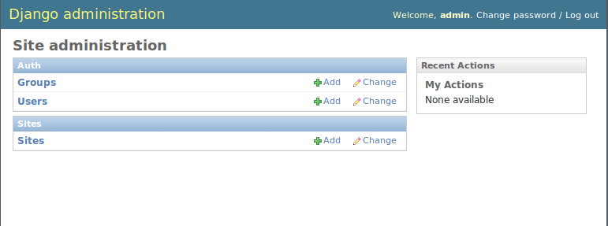
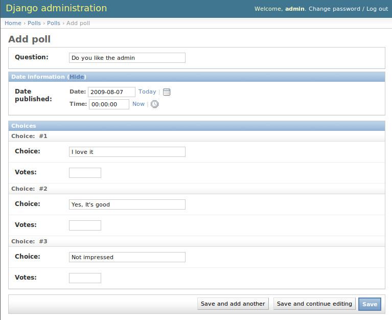
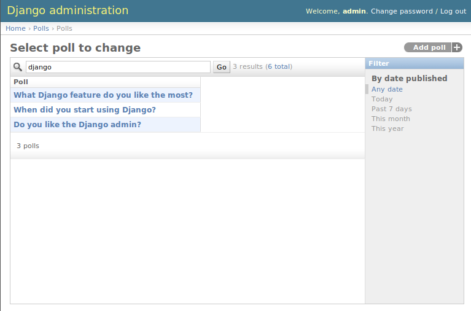
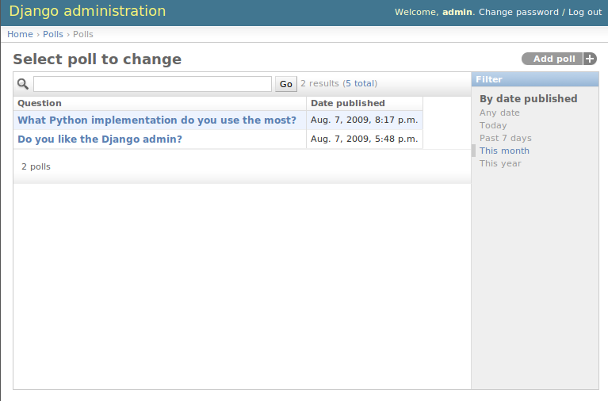
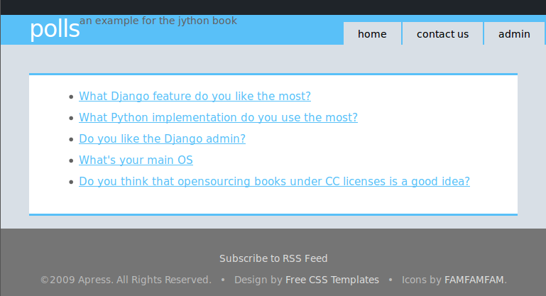
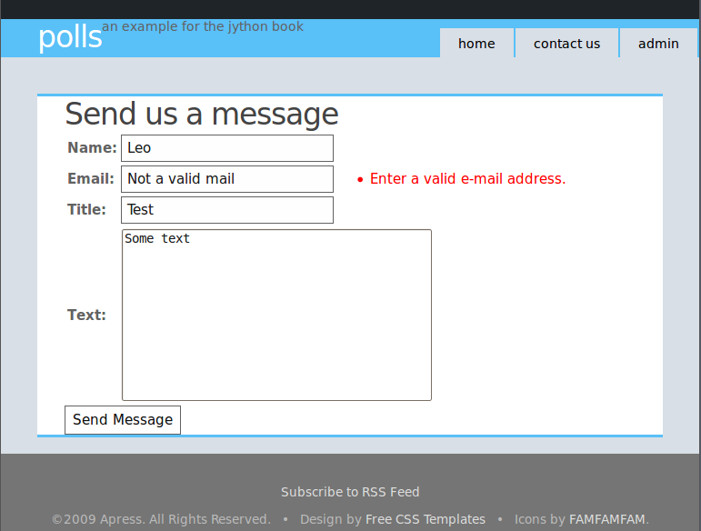

Chapter 14:  Web Applications with Django
+++++++++++++++++++++++++++++++++++++++++

Django is one of the modern Python web frameworks which redefined the web niche
in the Python world. A full stack approach, pragmatic design and superb
documentation are some of the reason for its success.

If fast web development using the Python language sounds good to you, then fast
web development using the Python language and with integration with the whole
Java world (which has a strong presence on the enterprise web space) sounds even
better. Running Django on Jython allows you to do just that!

And for the Java world, having Django as an option to quickly build web
applications while still having the chance to use the existing Java APIs and
technologies is very attractive.

In this chapter we will start with a quick introduction to have Django running
with your Jython installation in a few steps and then we will build a simple web
application to get a feeling of the framework. Later on, in the second half of
the chapter we will take a look at the many opportunities of integration between
Django web applications and the JavaEE world.

Getting Django
============== 

Strictly, to use Django with Jython you only need to get Django itself, and
nothing more. But, without third-party libraries, you won't be able to connect
to any database, since the built-in Django database backends depend of libraries
written in C, which aren't available on Jython.

In practice, you will need at least two packages: Django itself and
"django-jython", which, as you can imagine, is a collection of Django addons
that can be quite useful if you happen to be running Django on top of Jython. In
particular it includes database backends, which is something you definitely need
to fully appreciate the power of Django.

Since the process of getting these two libraries slightly varies depending on
your platform, and it's a manual, boring task, we will use an utility to
automatically grab and install these libraries. The utility is called
"setuptools". The catch is that we need to manually install setuptools, of
course, but this is quite straightforward.

First, download ez_setup.py from
http://peak.telecommunity.com/dist/ez_setup.py. Then, go to the directory where
you left the downloaded file and execute::

    $ jython ez_setup.py

You will see the following output::

    Downloading http://pypi.python.org/packages/2.5/s/setuptools/setuptools-0.6c9-py2.5.egg
    Processing setuptools-0.6c9-py2.5.egg
    Copying setuptools-0.6c9-py2.5.egg to /home/lsoto/jython2.5.0/Lib/site-packages
    Adding setuptools 0.6c9 to easy-install.pth file
    Installing easy_install script to /home/lsoto/jython2.5.0/bin
    Installing easy_install-2.5 script to /home/lsoto/jython2.5.0/bin
    
    Installed /home/lsoto/jython2.5.0/Lib/site-packages/setuptools-0.6c9-py2.5.egg
    Processing dependencies for setuptools==0.6c9
    Finished processing dependencies for setuptools==0.6c9

(Naturally, the filesystem paths will change, but it will be essentially the
same)

After this, you have setuptools installed, and the ``easy_install`` command
available. Armed with this we proceed to install Django::

    $ easy_install Django==1.0.3
  
.. note::

   I'm assuming that the ``bin`` directory of the Jython installation is on your
   ``PATH``. If it's not, you will have to explicitly type that path preceding
   each command like ``jython`` or ``easy_install`` with that path (i.e., you
   will need to type something like ``/path/to/jython/bin/easy_install`` instead
   of just ``easy_install``)

By reading the output of ``easy_install`` you can see how it is doing all the
tedious work of locating the right package, downloading and installing it::

    Searching for Django==1.0.3
    Reading http://pypi.python.org/simple/Django/
    Reading http://www.djangoproject.com/
    Reading http://www.djangoproject.com/download/1.0.1-beta-1/tarball/
    Best match: Django 1.0.3
    Downloading http://media.djangoproject.com/releases/1.0.3/Django-1.0.3.tar.gz
    Processing Django-1.0.3.tar.gz
    Running Django-1.0.3/setup.py -q bdist_egg --dist-dir
    /tmp/easy_install-nTnmlU/Dj  ango-1.0.3/egg-dist-tmp-L-pq4s
    zip_safe flag not set; analyzing archive contents...
    Unable to analyze compiled code on this platform.
    Please ask the author to include a 'zip_safe' setting (either True or False)
    in the package's setup.py
    Adding Django 1.0.3 to easy-install.pth file
    Installing django-admin.py script to /home/lsoto/jython2.5.0/bin
    
    Installed /home/lsoto/jython2.5.0/Lib/site-packages/Django-1.0.3-py2.5.egg
    Processing dependencies for Django==1.0.3
    Finished processing dependencies for Django==1.0.3

Then we install django-jython::

    $ easy_install django-jython

Again, you will get an output similar to what you've seen in the previous
cases. Once this is finished, you are ready.

If you want to look behind the scenes, take a look at the ``Lib/site-packages``
subdirectory inside your Jython installation and you will entries for the
libraries we just installed. Those entries are also listed on the
``easy-install.pth`` file, making them part of ``sys.path`` by default.

Just to make sure that everything went fine, start jython and try the following
statements, which import the top-level packages of Django and django-jython::

    >>> import django
    >>> import doj

If you don't get any error printed out on the screen, then everything is
OK. Let's start our first application.

A Quick Tour of Django
======================

.. note:: 

   If you are already familiar with Django, you won't find anything specially
   new in the rest of this section. Feel free to jump to `J2EE deployment and
   integration`_ to look at what's really special if you run Django on Jython.

Django is a full-stack framework. That means that it features cover from
communication to the database, to URL processing and web page templating. As you
may know, there are complete books which cover Django in detail. We aren't going
to go into much detail, but we *are* going to touch many of the features
included in the framework, so you can get a good feeling of its strengths in
case you haven't had the chance to know or try Django in the past. That way you
will know when Django is the right tool for a job.

The only way to take a broad view of such a resourceful framework like Django is
to build something really simple with it, and then gradually augment it as we
look into what the framework offers. So, we will start following roughly what
the official Django tutorial uses (a simple site for polls) to extend it later
to touch most of the framework features. In other words: most of the code you
will see in this section comes directly from the great Django tutorial you can
find on http://docs.djangoproject.com/en/1.0/intro/tutorial01/.

Now, as I said on the previous paragraph, Django handles the communication with
the database. Right now, the more solid backend in existence for Django/Jython
is the one for PostgreSQL. So I encourage you to install PostgreSQL on your
machine and setup an user and an empty database to use it in the course of this
tour.

Starting a Project (and an "App")
---------------------------------

Django projects, which are usually meant to be complete web sites (or
"sub-sites") are composed of a settings file, a URL mappings file and a set of
"apps" which provide the actual features of the web site. As you surely have
realized, many web sites share a lot of features: administration interfaces,
user authentication/registration, commenting systems, news feeds, contact forms,
etc. That's why Django decouples the actual site features in the "app" concept:
apps are meant to be *reusable* between different projects (sites).

As we will start small, our project will consist of only one app at first. We
will call our project "pollsite". So, let's create a clean new directory for what
we will build on this sections, move to that directory and run::

    $ django-admin.py startproject pollsite

And a python package named "pollsite" will be created under the directory you
created previously. At this point, the most important change we *need* to make
to the default settings of our shiny new project is to fill the information so
Django can talk to the database we created for this tour. So, open the file
``pollsite/settings.py`` with your text editor of choice and change lines
starting with ``DATABASE`` with something like this::

    DATABASE_ENGINE = 'doj.backends.zxjdbc.postgresql'
    DATABASE_NAME = '<the name of the empty database you created>' 
    DATABASE_USER = '<the name of the user with R/W access to that database>' 
    DATABASE_PASSWORD = '<the password of such user>'

With this, you are telling Django to use the postgresql driver provided by the
``doj`` package (which, if you remember from the `Getting Django`_ section, was
the package name of the django-jython project) and to connect with the given
credentials. Now, this backend requires the PostgreSQL JDBC driver, which you
can download at http://jdbc.postgresql.org/download.html.

Once you download the JDBC driver, you need to add it to the Java
``CLASSPATH``. An way to do it in Linux/Unix/MacOSX for the current
session is::

    $ export CLASSPATH=$CLASSPATH:/path/to/postgresql-jdbc.jar

If you are on Windows, the command is different::

    $ set CLASSPATH=%CLASSPATH%:\path\to\postgresql-jdbc.jar

Done that, we will create the single app which will be the core of our
project. Make sure you are into the ``pollsite`` directory and run::

    $ jython manage.py startapp polls

This will create the basic structure of a Django app. Note that the app was
created inside the project package, so we have the ``pollsite`` project and the
``pollsite.polls`` app. 

Now we will see what's inside a Django app.

Models
------

In Django, you define your data schema in Python code, using Python
classes. This central schema is used to generate the needed SQL statements to
create the database schema, and to dynamically generate SQL queries when you
manipulate objects of these special Python classes.

Now, in Django you don't define the schema of the whole project in a single
central place. After all, since apps are the real providers of features, it
follows that the schema of the whole project isn't more that the combination of
the schemas of each app. By the way, we will switch to Django terminology now,
and instead of talking about data schemas, we will talk about models (which are
actually a bit more than just schemas, but the distinction is not important at
this point).

If you look into the ``pollsite/polls`` directory, you will see that there is a
``models.py`` file, which is where the app's models must be defined. The
following code contains the model for simple polls, each poll containing many
choices::
    
    from django.db import models
    
    class Poll(models.Model):
        question = models.CharField(max_length=200)
        pub_date = models.DateTimeField('date published')
    
        def __unicode__(self):
            return self.question
        
    class Choice(models.Model):
        poll = models.ForeignKey(Poll)
        choice = models.CharField(max_length=200)
        votes = models.IntegerField()
    
        def __unicode__(self):
            return self.choice

As you can see, the map between a class inheriting from ``models.Model`` and a
database table is clear, and its more or less obvious how each Django field
would be translated to a SQL field. Actually, Django fields can carry more
information than SQL fields can, as you can see on the ``pub_date`` field which
includes a description more suited for human consumption: "date
published". Django also provides more specialized field for rather common types
seen on today web applications, like ``EmailField``, ``URLField`` or
``FileField``. They free you from having to write the same code again and again
to deal with concerns such as validation or storage management for the data
these fields will contain.

Once the models are defined, we want to create the tables which will hold the
data on the database. First, you will need to add app to the project settings
file (yes, the fact that the app "lives" under the project package isn't
enough). Edit the file ``pollsite/settings.py`` and add ``'pollsite.polls'``
to the ``INSTALLED_APPS`` list. It will look like this::

    INSTALLED_APPS = (
       'django.contrib.auth',
       'django.contrib.contenttypes',
       'django.contrib.sessions',
       'django.contrib.sites',
       'pollsite.polls',
    )
   
.. note:: 

   As you see, there were a couple of apps already included in your project.
   These apps are included on every Django project by default, providing some of
   the basic features of the framework, like sessions.

After that, we make sure we are located on the project directory and run::

    $ jython manage.py syncdb

If the database connection information was correctly specified, Django will
create tables and indexes for our models *and* for the models of the other apps
which were also included by default on ``INSTALLED_APPS``. One of these extra
apps is ``django.contrib.auth``, which handle user authentication. That's why
you will also be asked for the username and password for the initial admin user for
your site::

    Creating table auth_permission
    Creating table auth_group
    Creating table auth_user
    Creating table auth_message
    Creating table django_content_type
    Creating table django_session
    Creating table django_site
    Creating table polls_poll
    Creating table polls_choice
    
    You just installed Django's auth system, which means you don't have any
    superusers defined.
    Would you like to create one now? (yes/no): 

Answer yes to that question, and provide the requested information::

    Username (Leave blank to use u'lsoto'): admin
    E-mail address: admin@mailinator.com
    Warning: Problem with getpass. Passwords may be echoed.
    Password: admin
    Warning: Problem with getpass. Passwords may be echoed.
    Password (again): admin
    Superuser created successfully.

After this, Django will continue mapping your models to RDBMS artifacts,
creating some indexes for your tables::

    Installing index for auth.Permission model
    Installing index for auth.Message model
    Installing index for polls.Choice model

If we want to know what's doing Django behind the scenes, we can ask that, using
the ``sqlall`` management command (which are how the commands recognized by
``manage.py`` are called, like the recently used ``syncdb``). This command
requires an app *label* as argument and prints the SQL statements corresponding
to the models contained in the app. By the way, the emphasis on *label* was
intentional, as it corresponding to the last part of the "full name" of an app
and not to the full name itself. In our case, the label of "pollsite.polls" is
simply "polls". So, we can run::

    $ jython manage.py sqlall polls

And we get the following output::

    BEGIN;
    CREATE TABLE "polls_poll" (
        "id" serial NOT NULL PRIMARY KEY,
        "question" varchar(200) NOT NULL,
        "pub_date" timestamp with time zone NOT NULL
    )
    ;
    CREATE TABLE "polls_choice" (
        "id" serial NOT NULL PRIMARY KEY,
        "poll_id" integer NOT NULL 
	    REFERENCES "polls_poll" ("id") DEFERRABLE INITIALLY DEFERRED,
        "choice" varchar(200) NOT NULL,
        "votes" integer NOT NULL
    )
    ;
    CREATE INDEX "polls_choice_poll_id" ON "polls_choice" ("poll_id");
    COMMIT;

Two things to note here. First, each table got an ``id`` field which wasn't
explicitely specified on our model definition. That's automatic, and is a
sensible default (which can be overridden if you really need a different type of
primary key, but that's outside the scope of this quick tour). Second, see how
the sql is tailored to the particular RDBMS we are using (PostgreSQL in this
case), so naturally it may change if you use a different database backend.

OK, Let's move on. We have our model defined, and ready to store polls. The
typical next step here would be to make a CRUD administrative interface so polls
can be created, edited, removed, etc. Oh, and of course we may envision some
searching and filtering capabilities for this administrative, knowing in advance
that once the amount of polls grow too much it will become really hard to
manage. 

Well, no. We won't write this administrative interface from scratch. We will use
one of the most useful features of Django: The admin app.

Bonus: The Admin
----------------

This is an intermission on our tour through the main architectural points of a
Django project (namely: models, views and templates) but is a very nice
intermission. The code for the administrative interface we talked about a couple
of paragraph back will consist on less than 20 lines of code!

First, let's enable the admin app. To do this, edit ``pollsite/settings.py`` and
add ``'django.contrib.admin'`` to the ``INSTALLED_APPS``. Then edit
``pollsite/urls.py`` which looks like this::

    from django.conf.urls.defaults import *
    
    # Uncomment the next two lines to enable the admin:
    # from django.contrib import admin
    # admin.autodiscover()
    
    urlpatterns = patterns('',
        # Example:
        # (r'^pollsite/', include('pollsite.foo.urls')),
    
        # Uncomment the admin/doc line below and add 'django.contrib.admindocs' 
        # to INSTALLED_APPS to enable admin documentation:
        # (r'^admin/doc/', include('django.contrib.admindocs.urls')),
    
        # Uncomment the next line to enable the admin:
        # (r'^admin/(.*)', admin.site.root),
    )

And uncomment the lines which enable the admin (but not the ``admin/doc``!), so
the file will look this way::

    from django.conf.urls.defaults import *
    
    # Uncomment the next two lines to enable the admin:
    from django.contrib import admin
    admin.autodiscover()
    
    urlpatterns = patterns('',
        # Example:
        # (r'^pollsite/', include('pollsite.foo.urls')),
    
        # Uncomment the admin/doc line below and add 'django.contrib.admindocs' 
        # to INSTALLED_APPS to enable admin documentation:
        # (r'^admin/doc/', include('django.contrib.admindocs.urls')),
    
        # Uncomment the next line to enable the admin:
        (r'^admin/(.*)', admin.site.root),
    )

Now you can remove all the remaining commented lines, so ``urls.py`` ends up
with the following contents::

    from django.conf.urls.defaults import *
    
    from django.contrib import admin
    admin.autodiscover()
    
    urlpatterns = patterns('',
        (r'^admin/(.*)', admin.site.root),
    )

I know I haven't explained this ``urls.py`` file yet, but trust me, we will see
it in the next section.

Finally, let's create the database artifacts needed by the admin app, running::

    $ jython manage.py syncdb 

Now we will see how this admin looks like. Let's run our site in development
mode by executing::

    $ jython manage.py runserver

.. note::

   The development web server is an easy way to test your web project. It will
   run indefinitely until you abort it (for example, hitting ``Ctrl + C``) and
   will reload itself when you change a source file already loaded by the
   server, thus giving almost instant feedback. But, be advised that using this
   development server in production is a really, really bad idea.

Using a web browser, navigate to http://localhost:8000/admin/. You will
be presented with a login screen. Use the user credential you made when we first
ran ``syncdb`` in the previous section. Once you log in, you will see a page
like the one shown in the figure :ref:`fig-django-tour-admin`.

.. _fig-django-tour-admin:

   
   The Django Admin

As you can see, the central area of the admin shows two boxes, titled "Auth" and
"Sites". Those boxes correspond to the "auth" and "sites" apps that are built in
on Django. The "Auth" box contain two entries: "Groups" and "Users", each one
corresponding to a model contained in the auth app. If you click the "Users"
link you will be presented with the typical options to add, modify and remove
users. This is the kind of interfaces that the admin can provide to any other
Django app, so we will add our polls app to it.

Doing so is a matter of creating an ``admin.py`` file under your app (that is,
``pollsite/polls/admin.py``) and declaratively telling the admin how you want to
present your models in the admin. To administer polls, the following will make
the trick::

    # polls admin.py
    from pollsite.polls.models import Poll, Choice
    from django.contrib import admin

    class ChoiceInline(admin.StackedInline):
        model = Choice
        extra = 3

    class PollAdmin(admin.ModelAdmin):
        fieldsets = [
            (None,               {'fields': ['question']}),
            ('Date information', {'fields': ['pub_date'], 
	                          'classes': ['collapse']}),
        ]
        inlines = [ChoiceInline]

    admin.site.register(Poll, PollAdmin)
 
This may read like magic to you, but remember that I'm moving quick, as I want
you to take a look at what's possible to do with Django. Let's look first at
what we get after writting this code. Start the development server, go to
http://localhost:8000/admin/ and see how a new "Polls" box appears now. If you
click the "Add" link in the "Polls" entry, you will see a page like the one on
the figure :ref:`fig-django-tour-addpoll`.

.. _fig-django-tour-addpoll:

   Adding a Poll using the Admin

Play a bit with the interface: create a couple of polls, remove one, modify
them. Note that the user interface is divided in three parts, one for the
question, another for the date (initially hidden) and other for the choices. The
first two were defined by the ``fieldsets`` of the ``PollAdmin`` class, which
let you define the titles of each section (where ``None`` means no title), the
fields contained (they can be more than one, of course) and additional CSS
classes providing behaviors like ``'collapse'``

It's fairly obvious that we have "merged" the administration of our two models
(``Poll`` and ``Choice``) into the same user interface, since choices ought to
be edited "inline" with their corresponding poll. That was done via the
``ChoiceInline`` class which declares what model will be inlined and how many empty
slots will be shown. The inline is hooked up into the ``PollAdmin`` later (since
you can include many inlines on any ``ModelAdmin`` class.

Finally, ``PollAdmin`` is registered as the administrative interface for the
``Poll`` model using ``admin.site.register()``. As you can see, everything is
absolutely declarative and works like a charm.

The attentive reader is probably wondering what about the search/filter features
I talked about a few paragraphs back. Well, we will implement that, in the poll
list interface which you can access when clicking the "Change" link for Polls in
the main interface (or also by clicking the link "Polls", or after adding a
Poll).

So, add the following lines to the ``PollAdmin`` class::

    search_fields = ['question']
    list_filter = ['pub_date']

And play with the admin again (that's why it was a good idea to create a few
polls in the last step). The figure :ref:`fig-django-tour-adminsearch` shows the
search working, using "django" as the search string.

.. _fig-django-tour-adminsearch:

   Searching on the Django Admin

Now, if you try the filter by publishing date, it feels a bit awkward because
the list of polls only shows the name of the poll, so you can't see what's the
publishing date of the polls being filtered, to check if the filter worked as
advertished. That's easy to fix, by adding the following line to the
``PollAdmin`` class::

    list_display = ['question', 'pub_date']

The figure :ref:`fig-django-tour-adminfilter` shows how the interface looks
after all these additions.

.. _fig-django-tour-adminfilter:

   Filtering and listing more fields on the Django Admin

Once again you can see how admin offers you all these commons features
almost for free, and you only have to say what you want in a purely declarative
way. However, in case you have more special needs, the admin has hooks which you
can use customize its behavior. It is so powerful that sometimes it happens
that a whole web application can be built based purely on the admin. See the
official docs http://docs.djangoproject.com/en/1.0/ref/contrib/admin/ for more
information.

Views and Templates
--------------------

Well, now that you know the admin I won't be able to use a CRUD to showcase the
rest of the main architecture of the web framework. That's OK: CRUDs are part of
almost all data driven web applications, but they aren't what make your site
different. So, now that we have delegated the tedium to the admin app, we will
concentrate on polls, which is our business.

We already have our models in place, so it's time to write our views, which are
the HTTP-oriented functions that will make our app talk with the outside (which
is, after all, the point of creating a *web* application).

.. note:: 

  Django developers half-jokingly say that Django follows the "MTV" pattern:
  Model, Template and View. These 3 components map directly to what other modern
  frameworks call Model, View and Controller. Django takes this apparently
  unorthodox naming schema because, strictly, the controller is the framework
  itself. What is called "controller" code in other frameworks is really tied to
  HTTP and output templates, so it's really part of the view layer. If you don't
  like this viewpoint, just remember to mentally map Django templates to "views"
  and Django views to "controllers".

By convention, code for views go into the app ``views.py`` file. Views are
simple functions which take an HTTP request, do some processing and return an
HTTP response. Since an HTTP response typically involves the construction of an
HTML page, templates aid views with the job of creating HTML output (and other
text-based outputs) in a more maintainable way than manually pasting strings
together.

The polls app will have a very simple navigation. First, the user will be
presented with an "index" with access to the list of the latest polls. He will
select one and we will show the poll "details", that is, a form with the
available choices and a button so he can submit his choice. Once a choice is
made, the user will be directed to a page showing the current results of the
poll he just voted on.

Before writting the code for the views: a good way to start designing a Django
app is to design its URLs. In Django you map URLs to views, using regular
expressions. Modern web development takes URLs seriously, and nice URLs (i.e,
without cruft like "DoSomething.do" or "ThisIsNotNice.aspx") are the
norm. Instead of patching ugly names with URL rewriting, Django offers a layer
of indirection between the URL which triggers a view and the internal name you
happen to give to such view. Also, as Django has an emphasis on apps that can be
reused across multiple projects, there is a modular way to define URLs so an app
can define the relative URLs for its views, and they can be later included on
different projects.

Let's start by modifying the ``pollsite/urls.py`` file to the following::

    from django.conf.urls.defaults import *
    
    from django.contrib import admin
    admin.autodiscover()
    
    urlpatterns = patterns('',
        (r'^admin/(.*)', admin.site.root),
        (r'^polls/', include('pollsite.polls.urls')),
    )

Note how we added the pattern which says: if the URL starts with ``polls/``
continue mat matching it following the patters defined on module
``pollsite.polls.urls``. So let's create the file ``pollsite/polls/urls.py``
(note that it will live inside the app) and put the following code in it::

    from django.conf.urls.defaults import *
    
    urlpatterns = patterns('pollsite.polls.views',
        (r'^$', 'index'),
        (r'^(\d+)/$', 'detail'),
        (r'^(\d+)/vote/$', 'vote'),
        (r'^(\d+)/results/$', 'results'),
    )

The first pattern says: If there is nothing else to match (remember that
``polls/`` was already matched by the previous pattern), use the ``index``
view. The others patterns include a placeholder for numbers, written in the
regular expression as ``\d+``, and it is captured (using the parenthesis) so it
will be passed as argument to their respective views. The end result is that an
URL like ``polls/5/results/`` will call the ``results`` view passing the string
``'5'`` as the second argument (the first view argument is always the
``request`` object). If you want to know more about Django URL dispatching, see
http://docs.djangoproject.com/en/1.0/topics/http/urls/.

So, from the URL patterns we just created, it can be seen that we need to write
the view functions named ``index``, ``detail``, ``vote`` and ``results``. Here
is code for ``pollsite/polls/views.py``::

    from django.shortcuts import get_object_or_404, render_to_response
    from django.http import HttpResponseRedirect
    from django.core.urlresolvers import reverse
    from pollsite.polls.models import Choice, Poll
    
    def index(request):
        latest_poll_list = Poll.objects.all().order_by('-pub_date')[:5]
        return render_to_response('polls/index.html', 
	                          {'latest_poll_list': latest_poll_list})
    
    def detail(request, poll_id):
        poll = get_object_or_404(Poll, pk=poll_id)
        return render_to_response('polls/detail.html', {'poll': poll})
    
    def vote(request, poll_id):
        poll = get_object_or_404(Poll, pk=poll_id)
        try:
            selected_choice = poll.choice_set.get(pk=request.POST['choice'])
        except (KeyError, Choice.DoesNotExist):
            # Redisplay the poll voting form.
            return render_to_response('polls/detail.html', {
                'poll': poll,
                'error_message': "You didn't select a choice.",
            })
        else:
            selected_choice.votes += 1
            selected_choice.save()
            # Always return an HttpResponseRedirect after successfully dealing
            # with POST data. This prevents data from being posted twice if a
            # user hits the Back button.
            return HttpResponseRedirect(
	        reverse('pollsite.polls.views.results', args=(poll.id,)))
    
    def results(request, poll_id):
        poll = get_object_or_404(Poll, pk=poll_id)
        return render_to_response('polls/results.html', {'poll': poll})
    
I know this was a bit fast, but remember that we are taking a *quick* tour. The
important thing here is to grasp the high level concepts. Each function defined
in this file is a view. You can identify them because, well, they are defined on
the ``views.py`` file. But perhaps more importantly, because they receive a
``request`` as a first argument.

So, we defined the views named ``index``, ``details``, ``vote`` and ``results``
which are going to be called when an URL match the patterns defined
previously. With the exception of ``vote``, they are straightforward, and follow
the same pattern: They search some data (using the Django ORM and helper
functions like ``get_object_or_404`` which, even if you aren't familiar with
them it's easy to intuitively imagine what they do), and then end up calling
``render_to_response``, passing the path of a template and a dictionary with the
data passed to the template.

.. note:: 

   The three trivial views described above represent cases so common in web
   development that Django provides an abstraction to implement them with even
   less code. The abstraction is called "Generic Views" and you can learn about
   them on http://docs.djangoproject.com/en/1.0/ref/generic-views/, as well as
   in the Django tutorial at
   http://docs.djangoproject.com/en/1.0/intro/tutorial04/#use-generic-views-less-code-is-better

The ``vote`` view is a bit more involved, and it ought to be, since it is the
one which do interesting things, namely, registering a vote. It has two paths:
one for the exceptional case in which the user has not selected any choice and
one in which the used did select one. See how in the first case the view ends up
rendering the same template which is rendered by the ``detail`` view:
``polls/detail.html``, but we pass an extra variable to the template to display
the error message so the user can know why he is still viewing the same page. In
the successful case in which the user selected a choice, we increment the votes
and *redirect* the user to the ``results`` view. 

We could have archived the redirection by just calling the view (something like
``return results(request, poll.id)``) but, as the comments say, is a good
practice to do an *actual* HTTP redirect after POST submissions to avoid
problems with the browser back button (or the refresh button). Since the view
code don't know to what URLs they are mapped (as that is expected to chance from
site to site when you reuse the app) the ``reverse`` function gives you the URL
for a given view and parameters.

Before taking a look at templates, a note about them. The Django template
language is pretty simple and intentionally *not* as powerful as a programming
language. You can't execute arbitrary python code nor call any function. It is
designed this way to keep templates simple and webdesigner-friendly. The main
features of the template language are expressions, delimited by double braces
(``{{`` and ``}}``), and directives (called "template tags"), delimited by
braces and the percent character (````). Expression can contain
dots which do both attribute access and item access (so you write ``{{ foo.bar
}}`` even if in Python you would write ``foo['bar']``) and also pipes to apply
filters to the expressions (like, for example, cut a string expression at some
given maximum length). And that's pretty much it. You see how obvious they are
on the following templates, but I'll give a bit of explanation when introducing
some non obvious template tags.

Now, it's time to see the templates for our views. As you can infer by reading
the views code we just wrote we need three templates: ``polls/index.html``,
``polls/detail.html`` and ``polls/results.html``. We will create the
``templates`` subdirectory inside the ``polls`` app, and then create the
templates under it. So here is the content of
``pollsite/polls/templates/polls/index.html``:

.. code-block:: django

    
    <ul>
      
      <li><a href="{{ poll.id }}/">{{ poll.question }}</a></li>
      
    </ul>
    
    
No polls are available.

    

Pretty simple, as you can see. Let's move to
``pollsite/polls/templates/polls/detail.html``:

.. code-block:: django

    <h1>{{ poll.question }}</h1>
    
    
<strong>{{ error_message }}</strong>

    
    <form action="./vote/" method="post">
    
        <input type="radio" name="choice" id="choice{{ forloop.counter }}"
    value="{    { choice.id }}" />
        <label for="choice{{ forloop.counter }}">{{ choice.choice }}</label> 
    
    <input type="submit" value="Vote" />
    </form>

One perhaps surprising construct on this template is the ``{{ forloop.counter
}}`` expression, which simply exposes the internal counter the surrounding ```` loop. 

Also note that the ```` template tag will evaluate to false a expression
that is not defined, as will be the case with ``error_message`` when this
template is called from the ``detail`` view.

Finally, here is ``pollsite/polls/templates/polls/results.html``:

.. code-block:: django

    <h1>{{ poll.question }}</h1>
     
    <ul>
    
        <li>{{ choice.choice }} -- {{ choice.votes }} 
	vote{{ choice.votes|pluralize }}</li>
    
    </ul>

In this template you can see the use of a filter, in the expression ``{{
choice.votes|pluralize }}``. It will output an "s" if the number of votes is
greater than 1, and nothing otherwise. To learn more about the template tags
and filters available by default in Django, see
http://docs.djangoproject.com/en/1.0/ref/templates/builtins/. And to know more
on how it works and how to create new filters and template tags, see
http://docs.djangoproject.com/en/1.0/ref/templates/api/.

At this point we have a fully working poll site. It's not pretty, and can use a
lot of polishing. But it works! Try it navigating to
http://localhost:8000/polls/.

Reusing Templates without "include": Template Inheritance
---------------------------------------------------------

Like many other template languages, Django also has a "include" directive. But
it's use is very rare, because there is a better solution for reusing templates:
inheritance.

It works just like class inheritance. You define a base template, with many
"blocks". Each block has a name. Then other templates can inherit from the base
template and override or extend the blocks. You are free to build inheritance
chains of any length you want, just like with class hierarchies. 

You may have noted that our templates weren't producing valid HTML, but only
fragments. It was convenient, to focus on the important parts of the templates,
of course. But it also happens that with a very minor modification they will
generate a complete, pretty HTML pages. As you probably guessed by now, they
will extend from a site-wide base template.

Since I'm not exactly good with web design, we will take a ready-made template
from http://www.freecsstemplates.org/. In particular, we will modify
this template: http://www.freecsstemplates.org/preview/exposure/.

Note that the base template is going to be site-wide, so it belongs to the
project, not to an app. We will create a ``templates`` subdirectory under the
*project* directory. Here is the content for ``pollsite/templates/base.html``:

.. code-block:: django

    <!DOCTYPE html PUBLIC "-//W3C//DTD XHTML 1.0 Strict//EN"
    "http://www.w3.org/TR/    xhtml1/DTD/xhtml1-strict.dtd">
    <html xmlns="http://www.w3.org/1999/xhtml">
      <head>
        <meta http-equiv="content-type" content="text/html; charset=utf-8" />
        <title>Polls</title>
        <link rel="alternate" type="application/rss+xml" 
              title="RSS Feed"  href="/feeds/polls/" />
        
      </head>
      <body>
        <!-- start header -->
        

          

            <h1><a href="/polls/">Polls</a></h1>
            
an example for the Jython book</a>

          

          

            <ul>
              <li><a href="/polls/">Home</a></li>
              <li><a href="/contact/">Contact Us</a></li>
              <li><a href="/admin/">Admin</a></li>
            </ul>
          

        

    <!-- end header -->
    <!-- start page -->
        

        <!-- start content -->
          

             
          

    <!-- end content -->
           
        

    <!-- end page -->
    <!-- start footer -->
        

          
 <a href="/feeds/polls/">Subscribe to RSS Feed</a> 

          

            &copy;2009 Apress. All Rights Reserved.
            &nbsp;&nbsp;&bull;&nbsp;&nbsp;
            Design by 
	    <a href="http://www.freecsstemplates.org/">Free CSS Templates</a>
            &nbsp;&nbsp;&bull;&nbsp;&nbsp;
            Icons by <a href="http://famfamfam.com/">FAMFAMFAM</a>. 

        

    <!-- end footer -->
      </body>
    </html>
    
As you can see, the template declares only one block, named "content" (near the
end of the template before the footer). You can define as many blocks as
you want, but to keep things simple we will do only one.

Now, to let Django find this template we need to tweak the settings. Edit
``pollsite/settings.py`` and locate the ``TEMPLATE_DIRS`` section. replace it
with the following::

    import os
    TEMPLATE_DIRS = (
        os.path.dirname(__file__) + '/templates',
        # Put strings here, like "/home/html/django_templates" or
        # "C:/www/django/templates".
        # Always use forward slashes, even on Windows.
        # Don't forget to use absolute paths, not relative paths.
    )

That's a trick to avoid hardcoding the project root directory. The trick may not
work on all situations, but it will work for us. Now, that we have this
``base.html`` template in place, we will inherit from it in
``pollsite/polls/templates/polls/index.html``:

.. code-block:: django

    
    
    
    <ul>
      
      <li><a href="{{ poll.id }}/">{{ poll.question }}</a></li>
      
    </ul>
    
    
No polls are available.

    
    

As you can see, the changes are limited to the addition of the two first lines
and the last one. The practical implication is that the template is overriding
the "content" block and inheriting all the rest. Do the same with the other two
templates of the poll app and test the application again, visiting
http://localhost:8000/polls/. It will look as shown on the figure
:ref:`fig-django-tour-aftertemplate`.

.. _fig-django-tour-aftertemplate:

   The Poll Site After Applying a Template

At this point we could consider our sample web application to be complete. But I
want to highlight some other features included in Django that can help you to
develop your web apps (just like the admin). To showcase them we will add the
following features to our site:

1. A contact form (note that the link is already included in our common base
   template)
  
2. A RSS feed for the latest polls (also note the link was already added on the
   footer) 

.. 3. User authentication

.. 4. User Comments on polls.

Forms
-----

Django features some help to deal with HTML forms, which is always a bit
tiresome. We will use this help to implement the "contact us" feature. Since it
sounds like a common feature that could be reused on in the future, we will
create a new app for it. Move to the project directory and run::

  $ jython manage.py startapp contactus

Remember to add an entry for this app on ``pollsite/settings.py`` under the
``INSTALLED_APPS`` list as ``'pollsite.contactus'``.

Then we will delegate URL matching the ``/contact/`` pattern to the app, by
modifying ``pollsite/urls.py`` and adding one line for it::

    from django.conf.urls.defaults import *
     
    from django.contrib import admin
    admin.autodiscover()
    
    urlpatterns = patterns('',
        (r'^admin/(.*)', admin.site.root),
        (r'^polls/', include('pollsite.polls.urls')),
        (r'^contact/', include('pollsite.contactus.urls')),
    )

Later, we create ``pollsite/contactus/urls.py``. For simplicity's sake we will
use only one view to display and process the form. So the file
``pollsite/contactus/urls.py`` will simply consist of::

    from django.conf.urls.defaults import *
    
    urlpatterns = patterns('pollsite.contactus.views',
        (r'^$', 'index'),
    )

And the contents of ``pollsite/contactus/views.py`` is::

    from django.shortcuts import render_to_response
    from django.core.mail import mail_admins
    from django import forms
    
    class ContactForm(forms.Form):
        name = forms.CharField(max_length=200)
        email = forms.EmailField()
        title = forms.CharField(max_length=200)
        text = forms.CharField(widget=forms.Textarea)
    
    
    def index(request):
        if request.method == 'POST':
            form = ContactForm(request.POST)
            if form.is_valid():
                mail_admins(
                    "Contact Form: %s" % form.title,
                    "%s <%s> Said: %s" % (form.name, form.email, form.text))
                return render_to_response("contactus/success.html")
        else:
            form = ContactForm()
        return render_to_response("contactus/form.html", {'form': form})

The important bit here is the ``ContactForm`` class in which the form is
declaratively defined and which encapsulates the validation logic. We just call
the ``is_valid()`` method on our view to invoke that logic and act
accordingly. See http://docs.djangoproject.com/en/1.0/topics/email/#mail-admins
to learn about the ``main_admins`` function included on Django and how to
adjust the project settings to make it work.

Forms also provide quick ways to render them in templates. We will try that
now. This is the code for ``pollsite/contactus/templates/contactus/form.html``
which is the template used the the view we just wrote:

.. code-block:: django

    
    
    <form action="." method="POST">
    <table>
    {{ form.as_table }}
    </table>
    <input type="submit" value="Send Message" >
    </form>
    

Here we take advantage of the ``as_table()`` method of Django forms, which also
takes care of rendering validation errors. Django forms also provide other
convenience functions to render forms, but if none of them suits your need, you
can always render the form in custom ways. See
http://docs.djangoproject.com/en/1.0/topics/forms/ for details on form handling.

Before testing this contact form, we need to write the template
``pollsite/contactus/templates/contactus/success.html`` which is also used from
``pollsite.contactus.views.index``:: This template is quite simple::

    
    
    <h1> Send us a message </h1>
    
<b>Message received, thanks for your feedback!
 
    

And we are done. Test it by navigation to http://localhost:8000/contact/. Try
submitting the form without data, or with erroneous data (for example with an
invalid email address). You will get something like what's shown on the figure
:ref:`fig-django-tour-formvalidation`. Without needing to write much code you
get all that validation, almost for free. Of course the forms framework is
extensible, so you can create custom form field types with their own validation
or rendering code. Again, I'll refer you to
http://docs.djangoproject.com/en/1.0/topics/forms/ for detailed information.

.. _fig-django-tour-formvalidation:

   Django Form Validation in Action

Feeds
-----

It's time to implement the feed we are offering on the link right before the
footer. It surely won't surprise you to know that Django include ways to state
declaratively your feeds and write them very quickly. Let's start by modifying
``pollsite/urls.py`` to leave it as follows::

    from django.conf.urls.defaults import *
    from pollsite.polls.feeds import PollFeed
    
    from django.contrib import admin
    admin.autodiscover()
    
    urlpatterns = patterns('',
        (r'^admin/(.*)', admin.site.root),
        (r'^polls/', include('pollsite.polls.urls')),
        (r'^contact/', include('pollsite.contactus.urls')),
        (r'^feeds/(?P<url>.*)/$', 'django.contrib.syndication.views.feed',
         {'feed_dict': {'polls': PollFeed}}),
    )

The changes are the import of the ``PollFeed`` class (which we haven't wrote
yet) and the last pattern for URLs starting with ``/feeds/``, which will map to
a built-in view which takes a dictionary with feeds as argument (in our case,
``PollFeed`` is the only one). Writing the this class, which will describe the
feed, is very easy.  Let's create the file ``pollsite/polls/feeds.py`` and put
the following code on it::

    from django.contrib.syndication.feeds import Feed
    from django.core.urlresolvers import reverse
    from pollsite.polls.models import Poll
    
    class PollFeed(Feed):
        title = "Polls"
        link = "/polls"
        description = "Latest Polls"
    
        def items(self):
            return Poll.objects.all().order_by('-pub_date')
    
        def item_link(self, poll):
            return reverse('pollsite.polls.views.detail', args=(poll.id,))
    
        def item_pubdate(self, poll):
            return poll.pub_date
        
And we are almost ready. When a request for the URL ``/feeds/polls/`` is
received by Django, it will use this feed description to build all the XML
data. The missing part is how will be the content of polls displayed on the
feeds. To do this, we need to create a template. By convention, it has to be
named ``feeds/<feed_name>_description.html``, where ``<feed_name>`` is what we
specified as the key on the ``feed_dict`` in ``pollsite/urls.py``. Thus we
create the file ``pollsite/polls/templates/feeds/polls_description.html`` with
this very simple content:

.. code-block:: django

    <ul>
      
      <li>{{ choice.choice }}</li>
      
   </ul>

The idea is simple: Django passes each object returned by ``PollFeed.items()``
to this template, in which it takes the name ``obj``. You then generate an
HTML fragment which will be embedded on the feed result. 

And that's all. Test it by pointing your browser to
http://localhost:8000/feeds/polls/, or by subscribing to that URL with your
preferred feed reader. Opera, for example, displays the feed as shown by figure
:ref:`fig-django-tour-feed`

.. _fig-django-tour-feed:

.. figure:: images/chapter14-tour-feed.png

   Poll feed displayed on the Opera browser

.. User authentication
.. -------------------

.. Remember that the admin interface requires you to provide an username and
.. password to get access to it. Also remember that you could add new users using
.. the admin. The authentication framework behind it is available to any Django
.. app. We will make use of it, by requiring user authentication for votes.
.. TODO!

J2EE deployment and integration 
===============================

At the time of this writing, Django on Jython works on the 1.0.x release.
Unfortunately, the official Django site hasn't released a new build with all
the latest patches from source control.  To download the latest 1.0.x
release, you'll need to download the code with subversion and install
it ::

    svn co http://code.djangoproject.com/svn/django/tags/releases/1.0.2/ django-1.0.x
    cd django-1.0.x
    jython setup.py install

Next, you'll need to install the DjangoOnJython - a set of extensions
to Django to enable Jython integration. Grab the latest release from
Google Code ::

    http://code.google.com/p/django-jython/downloads/list

Download either the zip or the tar file and run "jython setup.py install" on
the package. This will install the 'doj' package into your Jython
installation. You've now got everything you need to start deploying
Django on Jython applications into a servlet container. 

Although you *could* deploy your application using Django's built in
development server, it's a terrible idea.  The development server
isn't designed to operate under heavy load and this is really a job
that is more suited to a proper application server.  We're going to
install Glassfish v2.1 - an opensource highly performant J2EE
application server from Sun Microsystems and show deployment onto it.

Let's install Glassfish now - obtain the release from ::

    https://glassfish.dev.java.net/public/downloadsindex.html

At the time of this writing, Glassfish v3.0 is being prepared for
release and it will support Django and Jython out of the box, but
we'll stick to the stable release as the documentation and stability
has been well established.  Download the v2.1 release (currently
v2.1-b60e).  I strongly suggest you use JDK6 to do your deployment.

Once you have the installation JAR file, you can install it by issuing
::

   % java -Xmx256m -jar glassfish-installer-v2.1-b60e-windows.jar

If your glassfish installer file has a different name, just use that
instead of the filename listed in the above example. Be careful where
you invoke this command though - Glassfish will unpack the application
server into a subdirectory 'glassfish' in the directory that you start
the installer.

One step that tripped me up during my impatient installation of
Glassfish is that you actually need to invoke ant to complete the
installation.  On UNIX you need to invoke ::

    % chmod -R +x lib/ant/bin
    % lib/ant/bin/ant -f setup.xml 

or for Windows ::

    % lib\ant\bin\ant -f setup.xml

This will complete the setup - you'll find a bin directory with
"asadmin" or "asadmin.bat" which will indicate that the application
server has been installed.. You can start the server up by invoking ::

    % bin/asadmin start_domain -v

On Windows, this will start the server in the foreground - the process
will not daemonize and run in the background.  On UNIX operating
systems, the process will automatically daemonize and run in the
background. In either case, once the server is up and running, you
will be able to reach the web administration screen through a browser
by going to http://localhost:5000/. The default login is 'admin' and
the password is 'adminadmin'.

Currently, Django on Jython only supports the Postgresql database
officially, but there is a preliminary release of a SQL Server backend
as well as a SQLite3 backend.  Let's get the postgresql backend
working - you will need to obtain the Postgresql JDBC driver from
http://jdbc.postgresql.org.   

At the time of this writing, the latest version was in
postgresql-8.4-701.jdbc4.jar, copy that jar file into your
GLASSFISH_HOME/domains/domain/domain1/lib directory. This will enable
all your applications hosted in your appserver to use the same JDBC
driver.

You should now have a GLASSFISH_HOME/domains/domain1/lib directory with the
following contents ::

    applibs/
    classes/
    databases/
    ext/
    postgresql-8.3-604.jdbc4.jar

You will need to stop and start the application server to let those
libraries load up. ::

    % bin/asadmin stop_domain
    % bin/asadmin start_domain -v

Deploying your first application
--------------------------------

Django on Jython includes a built in command to support the creation of WAR
files, but first, you will need to do a little bit of configuration you will
need to make everything run smoothly.  First we'll setup a simple Django
application that has the administration application enabled so that we have
some models that we play with.  Create a project called 'hello' and make sure
you add 'django.contrib.admin' and 'doj' applications to the INSTALLED_APPS.

Now enable the user admin by editting urls.py and uncomment the admin lines.
Your urls.py should now look something like this ::

    from django.conf.urls.defaults import *
    from django.contrib import admin
    admin.autodiscover()
    urlpatterns = patterns('',
        (r'^admin/(.*)', admin.site.root),
    )

One downside with running Django on Jython is that there is only support for
Postgresql currently.  Work is underway to support MSSQL, Oracle and SQLite.
For now, let's just use the postgresql backend to get things going.

Disabling Postgresql logins
---------------------------

The first thing I inevitably do on a development machine with Postgresql is
disable authenticaion checks to the database.  The fastest way to do this is to enable
only local connections to the database by editting the pg_hba.conf file.  For
Postgresql 8.3, this file is typically located in
c:\postgresql\8.3\data\pg_hba.conf and on UNIXes - it is typically located in
/etc/postgresql/8.3/data/pg_hba.conf  

At the bottom of the file, you'll find connection configuration information.
Comment out all the lines and enable trusted connections from localhost. 
Your editted configuration should look something like this ::

    # TYPE  DATABASE    USER        CIDR-ADDRESS          METHOD
    host    all         all         127.0.0.1/32          trust

This will let any username password to connect to the database.  You do not
want to do this for a public facing production server.  Consult the Postgresql
documentation for instructions for more suitable settings.  After you've
editted the connection configuration, you will need to restart the
postgresql server.

Create your postgresql database using the createdb command now ::

    > createdb demodb

Setting up the database is straightforward - just enable the pgsql
backend from Django on Jython.  Note that backend will expect a
username and password pair even though we've disabled them in
Postgresql.  You can populate anything you want for the DATABASE_NAME
and DATABASE_USER settings.  The database section of your settings
module should now look something like this ::

   DATABASE_ENGINE = 'doj.backends.zxjdbc.postgresql'
   DATABASE_NAME = 'demodb' 
   DATABASE_USER = 'ngvictor' 
   DATABASE_PASSWORD = 'nosecrets'

Initialize your database now 

    > jython manage.py syncdb
    Creating table django_admin_log
    Creating table auth_permission
    Creating table auth_group
    Creating table auth_user
    Creating table auth_message
    Creating table django_content_type
    Creating table django_session
    Creating table django_site

    You just installed Django's auth system, which means you don't have any superusers defined.
    Would you like to create one now? (yes/no): yes
    Username: admin
    E-mail address: admin@abc.com
    Warning: Problem with getpass. Passwords may be echoed.
    Password: admin
    Warning: Problem with getpass. Passwords may be echoed.
    Password (again): admin
    Superuser created successfully.
    Installing index for admin.LogEntry model
    Installing index for auth.Permission model
    Installing index for auth.Message model

All of this should be review so far, now we're going to take the
application and deploy it into the running Glassfish server.  This is
actually the easy part. Django on Jython comes with a custom 'war'
command that builds a self contained file which you can use to deploy
into any Java servlet container.

A note about WAR files
----------------------

For J2EE servers, a common way to deploy your applications is to
deploy a 'WAR' file.  This is just a fancy name for a zip file that
contains your application and any dependencies it requires that the
application server has not made available as a shared resource.  This
is a robust way of making sure that you minimize the impact of
versioning changes of libraries if you want to deploy multiple
applications in your app server.

Consider your Django applications over time - you will undoubtedly
upgrade your version of Django, you may upgrade the version of your
database drivers - you may even deciede to upgrade the version of the
Jython language you wish to deploy on.  These choices are ultimately
up to you if you bundle all your dependencies in your WAR file.
By bundling up all your dependencies into your WAR file, you
can ensure that your app will "just work" when you go to deploy it.
The server will automatically partition each application into its own
space with concurrently running versions of the same code. 

---

To enable the war command, add the 'doj' appplication to your
settings in the INSTALLED_APPS list.  Next, you will need to enable
your site's media directory and a context relative root for your
media.  Edit your settings.py module so that that your media files are 
properly configured to be served.  The war command will automatically
configure your media files so that they are served using a static file
servlet and the URLs will be remapped to be after the context root.

Edit your settings module and configure the MEDIA_ROOT and MEDIA_URL lines.

MEDIA_ROOT = 'c:\\dev\\hello\\media_root'
MEDIA_URL = '/site_media/'

Now you will need to create the media_root subdirectory under your 'hello'
project and drop in a sample file so you can verify that static content serving
is working.  Place a file "sample.html" into yoru media_root directory.  Put
whatever contents you want into it - we're just using this to ensure that
static files are properly served.

In english - that means when the above configuration is used - 'hello'
will deployed into your servlet container and the container will
assign some URL path to be the 'context root' in Glassfish's case -
this means your app will live in 'http://localhost:8000/hello/'.  The
site_media directory will be visible at
"http://localhost:8000/hello/site_media".  DOJ will automatically set
the static content to be served by Glassfish's fileservlet which is
already highly performant.  There is no need to setup a separate
static file server for most deployments.

Build your war file now using the standard manage.py script, and
deploy using the asadmin tool ::

    c:\dev\hello>jython manage.py war

    Assembling WAR on c:\docume~1\ngvictor\locals~1\temp\tmp1-_snn\hello

    Copying WAR skeleton...
    Copying jython.jar...
    Copying Lib...
    Copying django...
    Copying media...
    Copying hello...
    Copying site_media...
    Copying doj...
    Building WAR on C:\dev\hello.war...
    Cleaning c:\docume~1\ngvictor\locals~1\temp\tmp1-_snn...

    Finished.

    Now you can copy C:\dev\hello.war to whatever location your application server wants it.

    C:\dev\hello>cd \glassfish
    C:\glassfish>bin\asadmin.bat deploy hello.war
    Command deploy executed successfully.

    C:\glassfish>

That's it.  You should now be able to see your application running on ::

    http://localhost:8080/hello/

The administration screen should also be visible at :

    http://localhost:8080/hello/admin/

You can verify that your static media is being served correctly by going to:

    http://localhost:8080/hello/site_media/sample.html

That's it.  Your basic deployment to a servlet container is now working.

Extended installation
---------------------

XXX: TODO: war command extensions

Connection pooling with J2EE
----------------------------

While Django does not natively support database connection pools with CPython,
you can enable them in the Postgresql driver for Django on Jython.  Creating a
connection pool that is visible to Django/Jython is a two step process in
Glassfish.  First, we'll need to create a JDBC connection pool, then we'll need
to bind a JNDI name to that pool.  In a J2EE container, JNDI - the Java Naming
and Directory Interface - is a registry of names bound to objects.   It's
really best thought of as a hashtable that typically abstracts a factory that
emits objects.

In the case of database connections - JNDI abstracts a ConnectionFactory which
provides proxy objects that behave like database connections.  These proxies
automatically manage all the pooling behavior for us.  Lets see this in
practice now.

First we'll need to create a JDBC ConnectionFactory. Go to the administration
screen of Glassfish and go down to Resources/JDBC/JDBC Resources/Connection
Pools.  From there you can click on the 'New' button and start to configure
your pool.

Set the name to "pgpool-demo", the resource type should be
"javax.sql.ConnectionPoolDataSource" and the Database Vendor should be
PostgreSQL. Click 'Next'.

.. XXX: VN put a screen shot here

At the bottom of the next page, you'll see a section with "Additional
Properties".  You'll need to set four parameters to make sure the connection is
working, assuming that the database is configured for a username/password of
ngvictor/nosecrets - here's what you need to connect to your database.

============== ==========
Name           Value 
============== ==========
databaseName   demodb
serverName     localhost
password       nosecrets
user           ngvictor
============== ==========

You can safely delete all the other properties - they're not needed. Click 'Finish'.

.. XXX: Add screenshot here

Your pool will now be visible on the left hand tree control in the Connection
Pools list. Select it and try pinging it to make sure it's working.  If all is
well, Glassfish will show you a successful Ping message.

.. XXX: add screenshot of 'ping succeeded'

We now need to bind a JNDI name to the connection factory to provide a mechanism for Jython to see the pool.  Go to the JDBC Resources and click 'New'.
Use the JNDI name: "jdbc/pgpool-demo", select the 'pgpool-demo' as your pool name and hit "OK">

.. XXX: add screenshot here of the new JNDI resource

Verify from the command line that the resource is available ::

    glassfish\bin $ asadmin list-jndi-entries --context jdbc
    Jndi Entries for server within jdbc context:
    pgpool-demo__pm: javax.naming.Reference
    __TimerPool: javax.naming.Reference
    __TimerPool__pm: javax.naming.Reference
    pgpool-demo: javax.naming.Reference
    Command list-jndi-entries executed successfully.

Now, we need to enable the Django application use the JNDI name based lookup if
we are running in an application server, and fail back to regular database
connection binding if JNDI can't be found.  Edit your settings.py module and
add an extra configuration to enable JNDI. ::

   DATABASE_ENGINE = 'doj.backends.zxjdbc.postgresql'
   DATABASE_NAME = 'demodb' 
   DATABASE_USER = 'ngvictor' 
   DATABASE_PASSWORD = 'nosecrets'
   DATABASE_OPTIONS  = {'RAW_CONNECTION_FALLBACK': True, \
                        'JNDI_NAME': 'jdbc/pgpool-demo' }

Note that we're duplicating the configuration to connect to the database.  This
is because we want to be able to fall back to regular connection binding in the
event that JNDI lookups fail.  This makes our life easier when we're running in
a testing or development environment.

That's it.

You're finished configuring database connection pooling.  That wasn't that bad
now was it?

Dealing with long running tasks
-------------------------------

When you're building a complex web application, you will inevitably end up
having to deal with processes which need to be processed in the background.  If
you're building on top of CPython and Apache, you're out of luck here - there's
no standard infrastructure available for you to handle these tasks.   Luckily
these services have had years of engineering work already done for you in the
Java world.   We'll take a look at two different strategies for dealing with
long running tasks.  

Thread Pools
------------

The first strategy is is to leverage managed thread pools in the J2EE
container.  When your webapplication is running within Glassfish, each HTTP
request is processed by the HTTP Service which contains a threadpool.  You can
change the number of threads to affect the performance of the webserver.
Glassfish will also let you create your own threadpools to execute arbitrary
work units for you.

The basic API for threadpools is simple:

 * WorkManager which provides an abstracted interface to the thread pool
 * Work is an interface which encapsulates your unit of work
 * WorkListener which is an interface that lets you monitor the
   progress of your Work tasks.

First, we need to tell Glassfish to provision a threadpool for our
use.  In the Adminstration screen, go down to Configuration/Thread
Pools.  Click on 'New' to create a new thread pool.  Give your
threadpool the name "backend-workers".  Leave all the other settings
as the default values and click "OK".

You've now got a thread pool that you can use.  The threadpool exposes
an interface where you can submit jobs to the pool and the pool will
either execute the job synchronously within a thread, or you can
schedule the job to run asynchronously.  As long as your unit of work
implements the javax.resource.spi.work.Work interface, the threadpool
will happily run your code.  A unit of class may be as simple as the
following snippet of code ::

    from javax.resource.spi.work import Work

    class WorkUnit(Work):
        """
        This is an implementation of the Work interface.
        """
        def __init__(self, job_id):
            self.job_id = job_id

        def release(self):
            """
            This method is invoked by the threadpool to tell threads
            to abort the execution of a unit of work.
            """
            logger.warn("[%d] Glassfish asked the job to stop quickly" % self.job_id)

        def run(self):
            """
            This method is invoked by the threadpool when work is
            'running'
            """
            for i in range(20):
                logger.info("[%d] just doing some work" % self.job_id)

This WorkUnit class above doesn't do anything very interesting, but it
does illustrate the basic structure of what unit of work requires.
We're just logging message to disk so that we can visually see the
thread execute.

WorkManager implements several methods which can run your job and
block until the threadpool completes your work, or it can run the job
asynchronously.  Generally, I prefer to run things asynchronously and
simply check the status of the work over time.  This lets me submit
multiple jobs to the threadpool at once and check the status of each
of the jobs.

To monitor the progress of work, we need to implement the WorkListener
interface.  This interface gives us notifications as a task progresses
through the 3 phases of execution within the thread pool.  Those
states are :

 1) Accepted
 2) Started 
 3) Completed

All jobs must go to either Completed or Rejected states. The simplest
thing to do then is to simple build up lists capturing the events.
When the length of the completed and the rejected lists together are
the same as the number of jobs we submitted, we know that we are done.
By using lists instead of simple counters, we can inspect the work
objects in much more detail.

Here's the code for our SimpleWorkListener ::

    from javax.resource.spi.work import WorkListener
    class SimpleWorkListener(WorkListener):
        """
        Just keep track of all work events as they come in
        """
        def __init__(self):
            self.accepted = []
            self.completed = []
            self.rejected = []
            self.started = []

        def workAccepted(self, work_event):
            self.accepted.append(work_event.getWork())
            logger.info("Work accepted %s" % str(work_event.getWork()))

        def workCompleted(self, work_event):
            self.completed.append(work_event.getWork())
            logger.info("Work completed %s" % str(work_event.getWork()))

        def workRejected(self, work_event):
            self.rejected.append(work_event.getWork())
            logger.info("Work rejected %s" % str(work_event.getWork()))

        def workStarted(self, work_event):
            self.started.append(work_event.getWork())
            logger.info("Work started %s" % str(work_event.getWork()))

To access the threadpool, you simply need to know the name of the
pool we want to access and schedule our jobs.  Each time we schedule
a unit of work, we need to tell the pool how long to wait until we
timeout the job and provide a reference to the WorkListener so that we
can monitor the status of the jobs.  

The code to do this is listed below ::

    from com.sun.enterprise.connectors.work import CommonWorkManager
    from javax.resource.spi.work import Work, WorkManager, WorkListener
    wm = CommonWorkManager('backend-workers')
    listener = SimpleWorkListener()
    for i in range(5):
        work = WorkUnit(i)
        wm.scheduleWork(work, -1, None, listener)

You may notice that the scheduleWork method takes in a None in the
third argument.  This is the execution context - for our purposes,
it's best to just ignore it and set it to None.  The scheduleWork
method will return immediately and the listener will get callback
notifications as our work objects pass through.  To verify that all
our jobs have completed (or rejected) - we simply need to check the
listener's internal lists. ::

    while len(listener.completed) + len(listener.rejected) < num_jobs:
        logger.info("Found %d jobs completed" % len(listener.completed))
        time.sleep(0.1)

That covers all the code you need to access thread pools and monitor
the status of each unit of work.  Ignoring the actual WorkUnit class,
the actual code to manage the threadpool is about a dozen lines long.

J2EE standards and thread pools
-------------------------------

Unfortunately, this API is not standard in the J2EE 5 specification
yet so the code  listed here will only work in Glassfish.  The
API for parallel processing is being standardized for J2EE 6, and
until then you will need to know a little bit of the internals of your
particular application server to get threadpools working.  If you're
working with Weblogic or Websphere, you will need to use the CommonJ
APIs to access the threadpools, but the logic is largely the same.

Passing messages across process boundaries
------------------------------------------

While threadpools provide access to background job processing,
sometimes it may be beneficial to have messages pass across process
boundaries.  Every week there seems to be a new Python package that
tries to solve this problem, for Jython we are lucky enough to
leverage Java's JMS.  JMS specifies a message brokering technology
where you may define publish/subscribe or point to point delivery of
messages between different services.  Messages are asychnronously sent
to provide loose coupling and the broker deals with all manner of
boring engineering details like delivery guarantees, security,
durability of messages between server crashes and clustering.

While you could use a handrolled RESTful messaging implementation -
using OpenMQ and JMS has many advantages.

1) It's mature.  Do you really think your messaging implementation
   handles all the corner cases? Server crashes?  Network connectivity
   errors?  Reliability guarantees?  Clustering?  Security? OpenMQ has
   almost 10 years of engineering behind it.  There's a reason for
   that.

2) The JMS standard is just that - standard.  You gain the ability to
   send and receive messages between any J2EE code.

3) Interoperability.  JMS isn't the only messaging broker in town.
   The Streaming Text Orientated Messaing Protocol (STOMP) is another
   standard that is popular amongst non-Java developers.  You can turn
   a JMS broker into a STOMP broker by using stompconnect.  This means
   you can effectively pass messages between any messaging client and
   any messaging broker using any of a dozen different languages.

In JMS there are two types of message delivery mechanisms:

 * Publish/Subscribe: This is for the times when we want to message
   one or more subscribers about events that are occuring.  This is
   done through JMS 'topics'.
 * Point to point messaging:  These are single sender, single receiver
   message queues.  Appropriately, JMS calls these 'queues'

We need to provision a couple objects in Glassfish to get JMS going.
In a nutshell, we need to create a connection factory which clients
will use to connect to the JMS broker.   We'll create a
publish/subscribe resource and a point to point messaging queue.  In
JMS terms, there are called "destinations".  They can be thought of as
postboxes that you send your mail to.

Go to the Glassfish administration screen and go to Resources/JMS
Resources/Connection Factories.  Create a new connection factory with
the JNDI name: "jms/MyConnectionFactory".  Set the resource type to
javax.jms.ConnectionFactory.  Delete the username and password
properties at the bottom of the screen and add a single property:
'imqDisableSetClientID' with a value of 'false'.  Click 'OK'.

# TODO screenshot of the property setting

By setting the imqDisableSetClientID to false, we are forcing clients
to declare a username and password when they use the
ConnectionFactory.  OpenMQ uses the login to uniquely identify the
clients of the JMS service so that it can properly enforce the
delivery guarantees of the destination.

We now need to create the actual destinations - a topic for
publish/subscribe and a queue for point to point messaging. Go to
Resources/JMS Resources/Destination Resources and click 'New'. Set the
JNDI name to 'jms/MyTopic', the destination name to 'MyTopic' and the
Resource type to be 'javax.jms.Topic'.  Click "OK" to save the topic.

# TODO: create the topic image

Now we need to create the JMS queue for point to point messages.
Create a new resource, set the JNDI name to 'jms/MyQueue', the
destination name to 'MyQueue' and the resource type to
"javax.jms.Queue".  Click OK to save.

# TODO: create the queue image

Like the database connections discussed earlier, the JMS services are
also acquired in the J2EE container through the use of JNDI name
lookups.  Unlike the database code, we're going to have to do some
manual work to acquire the naming context which we do our lookups
against.    When our application is running inside of Glassfish,
acquiring a context is very simple.  We just import the class and
instantiate it.  The context provides a lookup() method which we use
to acquire the JMS connection factory and get access to the particular
destinations that we are interested in. In the folowing example, I'll
publish a message onto our topic. Lets see some code first and I'll go
over the finer details of what's going on ::

    from javax.naming import InitialContext, Session
    from javax.naming import DeliverMode, Message
    context = InitialContext()

    tfactory = context.lookup("jms/MyConnectionFactory")

    tconnection = tfactory.createTopicConnection('senduser', 'sendpass')
    tsession = tconnection.createTopicSession(False, Session.AUTO_ACKNOWLEDGE)
    publisher = tsession.createPublisher(context.lookup("jms/MyTopic"))

    message = tsession.createTextMessage()
    msg = "Hello there : %s" % datetime.datetime.now()
    message.setText(msg)
    publisher.publish(message, DeliveryMode.PERSISTENT, 
            Message.DEFAULT_PRIORITY, 100)
    tconnection.close()
    context.close()

In this code snippet, we acquire a topic connection through the connection
factory.  To reiterate - topics are for publish/subscribe scenarios.
We create a topic session - a context where we can send and receive
messages to next.  The two arguments passed to creating the topic
session specify a transactional flag and how our client will
acknowledge receipt of messages.  We're giong to just disable
transactions and get the session to automatically send
acknowledgements back to the broker on message receipt.

The last step to getting our publisher is well - creating the
publisher.  From there we can start publishing messages up to the
broker.

At this point - it is important to distinguish between persistent
messages and durable messages.  JMS calls a message 'persistent' if
the messages received by the *broker* are persisted.  This guarantees
that senders know that the broker has received a message.  It makes no
guarantee that messages will actually be delivered to a final
recipient.

Durable subscribers are guaranteed to receive messages in the case
that they temporarily drop their connection to the broker and
reconnect at a later time.  The JMS broker will uniquely identify
subscriber clients with a combination of the client ID, username and
password to uniquely identify clients and manage message queues for
each client.

Now we need to create the subscriber client.  We're going to write a
standalone client to show that your code doesn't have to live in the
application server to receive messages.  The only trick we're going to
apply here is that while we can simple create an InitialContext with
an empty constructor for code in the app server, code that exists
outside of the appliaction server must know where to find the JNDI
naming service.  Glassfish exposes the naming service via CORBA - the
Common Object Request Broker Architechture.. In short - we need to
know a factory class name to create the context and we need to know
the URL of where the object request broker is located. 

The following listener client can be run on the same host as the
Glassfish server ::

    """
    This is a standalone client that listens messages from JMS 
    """
    from javax.jms import TopicConnectionFactory, MessageListener, Session
    from javax.naming import InitialContext, Context
    import time

    def get_context():
        props = {}
        props[Context.INITIAL_CONTEXT_FACTORY]="com.sun.appserv.naming.S1ASCtxFactory"
        props[Context.PROVIDER_URL]="iiop://127.0.0.1:3700"
        context = InitialContext(props)
        return context

    class TopicListener(MessageListener):
        def go(self):
            context = get_context()
            tfactory = context.lookup("jms/MyConnectionFactory")
            tconnection = tfactory.createTopicConnection('recvuser', 'recvpass')
            tsession = tconnection.createTopicSession(False, Session.AUTO_ACKNOWLEDGE)
            subscriber = tsession.createDurableSubscriber(context.lookup("jms/MyTopic"), 'mysub')
            subscriber.setMessageListener(self)
            tconnection.start()
            while True:
                time.sleep(1)
            context.close()
            tconnection.close()

        def onMessage(self, message):
            print message.getText()

    if __name__ == '__main__':
        TopicListener().go()

There are only a few key differences between the subscriber and
publisher side of a JMS topic.  First, the subscriber is created with
a unique client id - in this case - it's 'mysub'.  This is used by JMS
to determine what pending messages to send to the client in the case
that the client drops the JMS connections and rebinds at a later time.
If we don't care to receive missed messages, we could have created a
non-durable subscriber with "createSubscriber" instead of
"createDurableSubscriber" and we would not have to pass in a client
ID.

Second, the listener employs a callback pattern for incoming messages.
When a message is received, the onMessage will be called automatically
by the subscriber object and the message object will be passed in.

Now we need to create our sending user and receiving user on the
broker.  Drop to the command line and go to GLASSFISH_HOME/imq/bin.
We are going to create two users - one sender and one receiver. ::

  GLASSFISH_HOME/imq/bin $ imqusermgr add -u senduser -p sendpass
  User repository for broker instance: imqbroker
  User senduser successfully added.

  GLASSFISH_HOME/imq/bin $ imqusermgr add -u recvuser -p recvpass
  User repository for broker instance: imqbroker
  User recvuser successfully added.

We now have two new users with username/pasword pairs of
senduser/sendpass and recvuser/recvpass.

You have enough code now to enable publish/subscribe messaging
patterns in your code to signal applications that live outside of your
application server.  We can potentially have multiple listeners
attached to the JMS broker and JMS will make sure that all subscribers
get messages in a reliable way.

Let's take a look now at sending message through a queue - this
provides reliable point to point messaging and it adds guarantees that
messages are persisted in a safe manner to safeguard against server
crashes.   This time, we'll build our send and receive clients as
individual standalone clients that communicate with the JMS broker. ::

    from javax.jms import Session
    from javax.naming import InitialContext, Context
    import time

    def get_context():
        props = {}
        props[Context.INITIAL_CONTEXT_FACTORY]="com.sun.appserv.naming.S1ASCtxFactory"
        props[Context.PROVIDER_URL]="iiop://127.0.0.1:3700"
        context = InitialContext(props)
        return context

    def send():
        context = get_context()
        qfactory = context.lookup("jms/MyConnectionFactory")
        # This assumes a user has been provisioned on the broker with
        # username/password of 'senduser/sendpass'
        qconnection = qfactory.createQueueConnection('senduser', 'sendpass')
        qsession = qconnection.createQueueSession(False, Session.AUTO_ACKNOWLEDGE)
        qsender = qsession.createSender(context.lookup("jms/MyQueue"))
        msg = qsession.createTextMessage()
        for i in range(20):
            msg.setText('this is msg [%d]' % i)
            qsender.send(msg)

    def recv():
        context = get_context()
        qfactory = context.lookup("jms/MyConnectionFactory")
        # This assumes a user has been provisioned on the broker with
        # username/password of 'recvuser/recvpass'
        qconnection = qfactory.createQueueConnection('recvuser', 'recvpass')
        qsession = qconnection.createQueueSession(False, Session.AUTO_ACKNOWLEDGE)
        qreceiver = qsession.createReceiver(context.lookup("jms/MyQueue"))
        qconnection.start()  # start the receiver

        print "Starting to receive messages now:"
        while True:
            msg = qreceiver.receive(1)
            if msg <> None and isinstance(msg, TextMessage):
                print msg.getText()

The send() and recv() functions are almost identical to the
publish/subscriber code used to manage topics.  A minor difference is
that the JMS queue APIs don't use a callback object for message
receipt.  It is assumed that client applications will actively
dequeue objects from the JMS queue instead of acting as a passive
subscriber.

The beauty of this JMS code is that you can send messages to the
broker and be assured that in case the server goes down, your messages
are not lost.  When the server comes back up and your endpoint client
reconnects - it will still receive all of it's pending messages.

We can extend this example even further.  Using stompconnect, we can turn our
JMS broker into a STOMP message broker.  This will enable us to have
applications written in just about *any* language communicate with our
applications over JMS.  There are times when I have existing CPython
code that leverages various C libraries like Imagemagick or NumPy to
do computations that are simply not supported with Jython or Java.

By using stompconnect, I can send work messages over JMS, bridge those
messages over STOMP and have CPython clients process my requests.  The
completed work is then sent back over STOMP, bridged to JMS and
received by my Jython code.

# TODO: add instructions for installing and connecting
Obtain the stompconnect

Complete code examples can be found

XXX: TODO need to list the JAR files you'll need to make sure these code samples work

