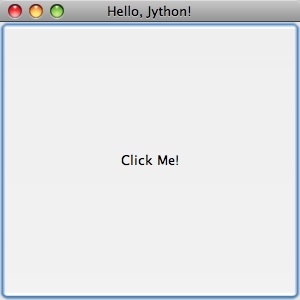

Chapter 17:  GUI Applications
=============================

The C implementation of Python comes with Tcl/TK for writing Graphical User
Interfaces (GUIs).  On Jython, the GUI toolkit that you get automatically is
Swing, which comes with the Java Platform.  Like CPython, there are other
toolkits available for writing GUIs in Jython.  Since Swing is available on any
modern Java installation, we will focus on the use of Swing GUIs in this
chapter.

Swing is a large subject, and can't really be covered in a single chapter.  In
fact there are entire books devoted to the subjuect.  I will provide some
introduction to Swing, but only enough to describe the use of Swing from
Jython. For in depth coverage of Swing, one of the many books or web tutorials
should be used. [FJW: some suggested books/tutorials?].

Using Swing from Jython has a number of advantages over the use of Swing in
Java.  For example, bean properties are less verbose in Jython, and binding
actions in Jython is much less verbose (in Java anonymous classes are typically
used, in Jython a function can be passed).

Let's start with an simple Swing application in Java, then we will look at the
same application in Jython. ::

    import java.awt.event.ActionEvent;
    import java.awt.event.ActionListener;
    import javax.swing.JButton;
    import javax.swing.JFrame;

    public class HelloWorld {

        public static void main(String[] args) {
            JFrame frame = new JFrame("Hello Java!");
            frame.setDefaultCloseOperation(JFrame.EXIT_ON_CLOSE);
            frame.setSize(300, 300);
            JButton button = new JButton("Click Me!");
            button.addActionListener(
                new ActionListener() {
                    public void actionPerformed(ActionEvent event) {
                        System.out.println("Clicked!");
                    }
                }
            );
            frame.add(button);
            frame.setVisible(true);
        }
    }

This simple application draws a JFrame that is completely filled with a JButton.  When the button is pressed, "Clicked!" prints out on the command line.

.. image:: src/chapter17/hello_java.jpg
   :align: center

Now let's see what this program looks like in Jython ::

    from javax.swing import JButton, JFrame

    frame = JFrame('Hello, Jython!',
                defaultCloseOperation = JFrame.EXIT_ON_CLOSE,
                size = (300, 300)
            )

    def change_text(event):
        print 'Clicked!'

    button = JButton('Click Me!', actionPerformed=change_text)
    frame.add(button)
    frame.visible = True

Except for the title, the application produces the same JFrame with JButton,
outputting "Clicked!" when the button is clicked.

Let's go through the Java and the Jython examples line by line to get a feel
for the differences between writing Swing apps in Jython and Java.  First the
import statements:

In Java ::

    import java.awt.event.ActionEvent;
    import java.awt.event.ActionListener;
    import javax.swing.JButton;
    import javax.swing.JFrame;

In Jython ::

    from javax.swing import JButton, JFrame

In Jython, it is always best to have explicit imports by name, instead of 
using ::

    from javax.swing import *

for the reasons covered in Chapter 7.  Note that we did not need to import
ActionEvent or ActionListener, since Jython's dynamic typing allowed us to
avoid mentioning these classes in our code.

Next, we have some code that creates a JFrame, and then sets a couple of bean
properties.

In Java ::
    JFrame frame = new JFrame("Hello Java!");
    frame.setDefaultCloseOperation(JFrame.EXIT_ON_CLOSE);
    frame.setSize(300, 300);

In Jython ::

    frame = JFrame('Hello, Jython!',
                defaultCloseOperation = JFrame.EXIT_ON_CLOSE,
                size = (300, 300)
            )

Larger example ::
    import twitter
    import re

    from javax.swing import (BoxLayout, ImageIcon, JButton, JFrame, JPanel,
            JPasswordField, JLabel, JTextArea, JTextField, JScrollPane,
            SwingConstants, WindowConstants)
    from java.awt import Component, GridLayout
    from java.net import URL
    from java.lang import Runnable

    class JyTwitter(object):
        def __init__(self):
            self.frame = JFrame("Jython Twitter")
            self.frame.setDefaultCloseOperation(WindowConstants.EXIT_ON_CLOSE)
     
            self.loginPanel = JPanel(GridLayout(0,2))
            self.frame.add(self.loginPanel)

            self.usernameField = JTextField('',15)
            self.loginPanel.add(JLabel("username:", SwingConstants.RIGHT))
            self.loginPanel.add(self.usernameField)

            self.passwordField = JPasswordField('', 15)
            self.loginPanel.add(JLabel("password:", SwingConstants.RIGHT))
            self.loginPanel.add(self.passwordField)

            self.loginButton = JButton('Log in',actionPerformed=self.login)
            self.loginPanel.add(self.loginButton)

            self.message = JLabel("Please Log in")
            self.loginPanel.add(self.message)

            self.frame.pack()
            self.frame.visible = True

        def login(self,event):
            self.message.text = "Attempting to Log in..."
            self.frame.show()
            username = self.usernameField.text
            try:
                self.api = twitter.Api(username, self.passwordField.text)
                self.timeline(username)
                self.loginPanel.visible = False
                self.message.text = "Logged in"
            except:
                self.message.text = "Log in failed."
                raise
            self.frame.size = 400,800
            self.frame.show()

        def timeline(self, username):
            timeline = self.api.GetFriendsTimeline(username)
            self.resultPanel = JPanel()
            self.resultPanel.layout = BoxLayout(self.resultPanel, BoxLayout.Y_AXIS)
            for s in timeline:
                self.showTweet(s)

            scrollpane = JScrollPane(JScrollPane.VERTICAL_SCROLLBAR_AS_NEEDED,
                                     JScrollPane.HORIZONTAL_SCROLLBAR_NEVER)
            scrollpane.preferredSize = 400, 800
            scrollpane.viewport.view = self.resultPanel

            self.frame.add(scrollpane)

        def showTweet(self, status):
            user = status.user
            p = JPanel()

            # image grabbing seems very expensive, good place for a callback?
            p.add(JLabel(ImageIcon(URL(user.profile_image_url))))

            p.add(JTextArea(text = status.text,
                            editable = False,
                            wrapStyleWord = True,
                            lineWrap = True,
                            alignmentX = Component.LEFT_ALIGNMENT,
                            size = (300, 1)
                 ))
            self.resultPanel.add(p)

    if __name__ == '__main__':
        JyTwitter()
