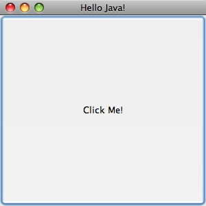
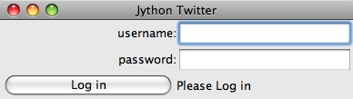
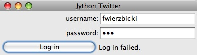
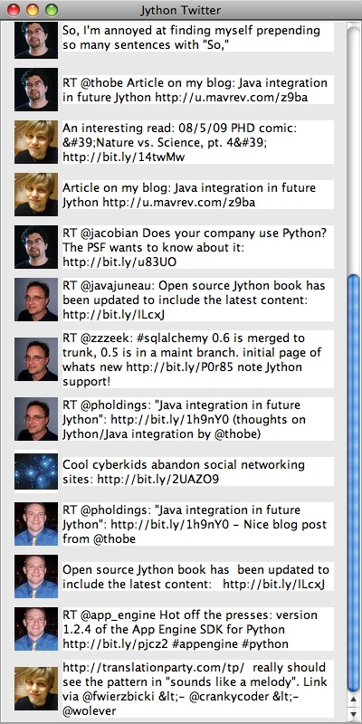

Chapter 17:  GUI Applications
=============================

The C implementation of Python comes with Tcl/TK for writing Graphical User
Interfaces (GUIs).  On Jython, the GUI toolkit that you get automatically is
Swing, which comes with the Java Platform.  Like CPython, there are other
toolkits available for writing GUIs in Jython.  Since Swing is available on any
modern Java installation, we will focus on the use of Swing GUIs in this
chapter.

Swing is a large subject, and can't really be covered in a single chapter.  In
fact there are entire books devoted to the subject.  I will provide some
introduction to Swing, but only enough to describe the use of Swing from
Jython. For in depth coverage of Swing, one of the many books or web tutorials
should be used. [FJW: some suggested books/tutorials?].

Using Swing from Jython has a number of advantages over the use of Swing in
Java.  For example, bean properties are less verbose in Jython, and binding
actions in Jython is much less verbose (in Java anonymous classes are typically
used, in Jython a function can be passed).

Let's start with an simple Swing application in Java, then we will look at the
same application in Jython. ::

    import java.awt.event.ActionEvent;
    import java.awt.event.ActionListener;
    import javax.swing.JButton;
    import javax.swing.JFrame;

    public class HelloWorld {

        public static void main(String[] args) {
            JFrame frame = new JFrame("Hello Java!");
            frame.setDefaultCloseOperation(JFrame.EXIT_ON_CLOSE);
            frame.setSize(300, 300);
            JButton button = new JButton("Click Me!");
            button.addActionListener(
                new ActionListener() {
                    public void actionPerformed(ActionEvent event) {
                        System.out.println("Clicked!");
                    }
                }
            );
            frame.add(button);
            frame.setVisible(true);
        }
    }

This simple application draws a JFrame that is completely filled with a
JButton.  When the button is pressed, "Clicked!" prints out on the command
line.

Now let's see what this program looks like in Jython ::

    from javax.swing import JButton, JFrame

    frame = JFrame('Hello, Jython!',
                defaultCloseOperation = JFrame.EXIT_ON_CLOSE,
                size = (300, 300)
            )

    def change_text(event):
        print 'Clicked!'

    button = JButton('Click Me!', actionPerformed=change_text)
    frame.add(button)
    frame.visible = True

Except for the title, the application produces the same JFrame with JButton,
outputting "Clicked!" when the button is clicked.

.. image:: images/chapter17-hello-jython.jpg
   :align: center

Let's go through the Java and the Jython examples line by line to get a feel
for the differences between writing Swing apps in Jython and Java.  First the
import statements:

In Java ::

    import java.awt.event.ActionEvent;
    import java.awt.event.ActionListener;
    import javax.swing.JButton;
    import javax.swing.JFrame;

In Jython ::

    from javax.swing import JButton, JFrame

In Jython, it is always best to have explicit imports by name, instead of 
using ::

    from javax.swing import *

for the reasons covered in Chapter 7.  Note that we did not need to import
ActionEvent or ActionListener, since Jython's dynamic typing allowed us to
avoid mentioning these classes in our code.

Next, we have some code that creates a JFrame, and then sets a couple of bean
properties.

In Java ::
    JFrame frame = new JFrame("Hello Java!");
    frame.setDefaultCloseOperation(JFrame.EXIT_ON_CLOSE);
    frame.setSize(300, 300);

In Jython ::

    frame = JFrame('Hello, Jython!',
                defaultCloseOperation = JFrame.EXIT_ON_CLOSE,
                size = (300, 300)
            )

In Java a new JFrame is created, then the bean properties defaultCloseOperation
and size are set.  In Jython, we are able to add the bean property setters
right in the call to the constructor.  This shortcut is covered in detail in
chapter [FJW]? already.  Still, it will bare some repeating here, since bean
properties are so important in the Swing libraries.  In short, if you have a 
getters and setters of the form getFoo/setFoo, you can treat them as properties
of the object with the name "foo".  So instead of x.getFoo() you can use x.foo.
Instead of x.setFoo(bar) you can use x.foo = bar.  If you take a look at any
Swing app above a reasonable size, you are likely to see large blocks of setters
like: ::

    JTextArea t = JTextArea();
    t.setText(message)
    t.setEditable(false)
    t.setWrapStyleWord(true)
    t.setLineWrap(true)
    t.setAlignmentX(Component.LEFT_ALIGNMENT)
    t.setSize(300, 1)

which, in my opinion, look better in the idiomatic Jython property setting style: ::

    t = JTextArea()
    t.text = message
    t.editable = False
    t.wrapStyleWord = True
    t.lineWrap = True
    t.alignmentX = Component.LEFT_ALIGNMENT
    t.size = (300, 1)

Or rolled into the constructor: ::

    t = JTextArea(text = message,
                  editable = False,
                  wrapStyleWord = True,
                  lineWrap = True,
                  alignmentX = Component.LEFT_ALIGNMENT,
                  size = (300, 1)
                 ))

One thing to watch out for when you use properties rolled into the constructor,
is that you don't know the order in which the setters will be called.
Generally this is not a problem, as the bean properties are not usually order
dependant.  The big exception to this is setVisible(), you probably want to set
the visible property outside of the constructor to avoid any strangeness while
the properties are being set.  Going back to our short example, the next block
of code creates a JButton, and binds the button to an action that prints out
"Clicked!".

In Java ::

    JButton button = new JButton("Click Me!");
    button.addActionListener(
        new ActionListener() {
            public void actionPerformed(ActionEvent event) {
                System.out.println("Clicked!");
            }
        }
    );
    frame.add(button);

In Jython ::

    def change_text(event):
        print 'Clicked!'

    button = JButton('Click Me!', actionPerformed=change_text)
    frame.add(button)

I think Jython's method is particularly nice here when compared to Java. Here
we can pass a first class function "change_text" directly to the JButton in
it's constructore, in place of the more cumbersome Java "addActionListener"
method where we need to create an anonymous ActionListener class and define
it's actionPerfomed method with all of the ceremony of the static type
declarations.  This is one case where Jython's readibility really stands out.
Finally, in both examples we set the visible property to True.  Again, although
we could have set this property in the frame constructor, the visible property
is one of those rare order-dependant properties that we want to set at the
right time (in this case, last).

In Java ::

    frame.setVisible(true);

In Jython ::

    frame.visible = True

Now that we have looked at a simple example, it makes sense to see what a medium
sized app might look like in Jython.  Since Twitter apps have become the "Hello
World" of GUI applications these days, we will go with the trend.  The following
application gives the user a log in prompt.  When the user successfully logs in
the  most recent tweets in their timeline are displayed.  Here is the code: ::

    import twitter
    import re

    from javax.swing import (BoxLayout, ImageIcon, JButton, JFrame, JPanel,
            JPasswordField, JLabel, JTextArea, JTextField, JScrollPane,
            SwingConstants, WindowConstants)
    from java.awt import Component, GridLayout
    from java.net import URL
    from java.lang import Runnable

    class JyTwitter(object):
        def __init__(self):
            self.frame = JFrame("Jython Twitter")
            self.frame.defaultCloseOperation = WindowConstants.EXIT_ON_CLOSE
     
            self.loginPanel = JPanel(GridLayout(0,2))
            self.frame.add(self.loginPanel)

            self.usernameField = JTextField('',15)
            self.loginPanel.add(JLabel("username:", SwingConstants.RIGHT))
            self.loginPanel.add(self.usernameField)

            self.passwordField = JPasswordField('', 15)
            self.loginPanel.add(JLabel("password:", SwingConstants.RIGHT))
            self.loginPanel.add(self.passwordField)

            self.loginButton = JButton('Log in',actionPerformed=self.login)
            self.loginPanel.add(self.loginButton)

            self.message = JLabel("Please Log in")
            self.loginPanel.add(self.message)

            self.frame.pack()
            self.frame.visible = True

        def login(self,event):
            self.message.text = "Attempting to Log in..."
            self.frame.show()
            username = self.usernameField.text
            try:
                self.api = twitter.Api(username, self.passwordField.text)
                self.timeline(username)
                self.loginPanel.visible = False
                self.message.text = "Logged in"
            except:
                self.message.text = "Log in failed."
                raise
            self.frame.size = 400,800
            self.frame.show()

        def timeline(self, username):
            timeline = self.api.GetFriendsTimeline(username)
            self.resultPanel = JPanel()
            self.resultPanel.layout = BoxLayout(self.resultPanel, BoxLayout.Y_AXIS)
            for s in timeline:
                self.showTweet(s)

            scrollpane = JScrollPane(JScrollPane.VERTICAL_SCROLLBAR_AS_NEEDED,
                                     JScrollPane.HORIZONTAL_SCROLLBAR_NEVER)
            scrollpane.preferredSize = 400, 800
            scrollpane.viewport.view = self.resultPanel

            self.frame.add(scrollpane)

        def showTweet(self, status):
            user = status.user
            p = JPanel()

            # image grabbing seems very expensive, good place for a callback?
            p.add(JLabel(ImageIcon(URL(user.profile_image_url))))

            p.add(JTextArea(text = status.text,
                            editable = False,
                            wrapStyleWord = True,
                            lineWrap = True,
                            alignmentX = Component.LEFT_ALIGNMENT,
                            size = (300, 1)
                 ))
            self.resultPanel.add(p)

    if __name__ == '__main__':
        JyTwitter()

This code depends on the python-twitter package. This package can be found on
the Python package index (PyPi).  If you have easy_install (see chapter ? for
instructions on easy_install) then you can install python-twitter like this: ::

    jython easy_install python-twitter

This will automatically install python-twitter's dependancy: simplejson.  Now
you should be able to run the application.  You should see the following login
prompt:

If you put in the wrong password, you should see:

And finally, once you have successfully logged in, you should see something
like this:

The constructor creates the outer frame, imaginatively called self.frame.
We set defaultCloseOperation so that the app will terminate if the user closes
the main window.  We then create a loginPanel that holds the text fields for
the user to enter username and password, and create a login button that will
call the self.login method when clicked.  We then put a "Please log in " label
in and make the frame visible. ::

    def __init__(self):
        self.frame = JFrame("Jython Twitter")
        self.frame.defaultCloseOperation = WindowConstants.EXIT_ON_CLOSE
 
        self.loginPanel = JPanel(GridLayout(0,2))
        self.frame.add(self.loginPanel)

        self.usernameField = JTextField('',15)
        self.loginPanel.add(JLabel("username:", SwingConstants.RIGHT))
        self.loginPanel.add(self.usernameField)

        self.passwordField = JPasswordField('', 15)
        self.loginPanel.add(JLabel("password:", SwingConstants.RIGHT))
        self.loginPanel.add(self.passwordField)

        self.loginButton = JButton('Log in',actionPerformed=self.login)
        self.loginPanel.add(self.loginButton)

        self.message = JLabel("Please Log in")
        self.loginPanel.add(self.message)

        self.frame.pack()
        self.frame.visible = True

The login method changes the label text and calls into python-twitter to
attempt a login.  It's in a try/excpet block that will display "Log in failed"
if something goes wrong.  A real application would check different types of
excpetions to see what went wrong and change the display message accordingly.
::

    def login(self,event):
        self.message.text = "Attempting to Log in..."
        self.frame.show()
        username = self.usernameField.text
        try:
            self.api = twitter.Api(username, self.passwordField.text)
            self.timeline(username)
            self.loginPanel.visible = False
            self.message.text = "Logged in"
        except:
            self.message.text = "Log in failed."
            raise
        self.frame.size = 400,800
        self.frame.show()

If the login succeeds, we call the timeline method, which populates the frame
with the latest tweets that the user is following.  In the timeline method, we
call GetFriendsTimeline from the python-twitter API, then we iterate through
the status objects and call showTweet on each.  All of this gets dropped into a
JScrollPane and set to a reasonable size, then added to the main frame. ::

    def timeline(self, username):
        timeline = self.api.GetFriendsTimeline(username)
        self.resultPanel = JPanel()
        self.resultPanel.layout = BoxLayout(self.resultPanel, BoxLayout.Y_AXIS)
        for s in timeline:
            self.showTweet(s)

        scrollpane = JScrollPane(JScrollPane.VERTICAL_SCROLLBAR_AS_NEEDED,
                                 JScrollPane.HORIZONTAL_SCROLLBAR_NEVER)
        scrollpane.preferredSize = 400, 800
        scrollpane.viewport.view = self.resultPanel

        self.frame.add(scrollpane)

In the showTweet method, we go through the tweets and add a a JLabel with the
user's icon (fetched by url from user.profile_image_url) and a JTextArea to
contain the text of the tweet.  Note all of the bean properties that we set to
get the JTextArea to display correctly. ::

    def showTweet(self, status):
        user = status.user
        p = JPanel()

        # image grabbing seems very expensive, good place for a callback?
        p.add(JLabel(ImageIcon(URL(user.profile_image_url))))

        p.add(JTextArea(text = status.text,
                        editable = False,
                        wrapStyleWord = True,
                        lineWrap = True,
                        alignmentX = Component.LEFT_ALIGNMENT,
                        size = (300, 1)
             ))
        self.resultPanel.add(p)

And that concludes our quick tour of Swing from Jython.  Again, Swing is a very
large subject, so you'll want to look into some more dedicated Swing resources
to really get a handle on it.  After this chapter, it should be reasonably
straightforward to translate the Java examples you find into Jython examples.
