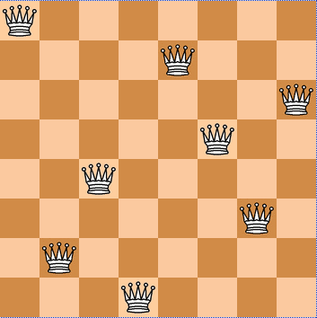
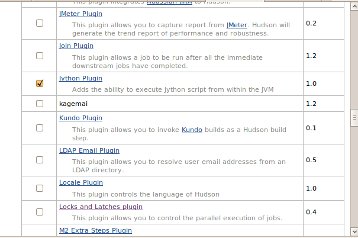
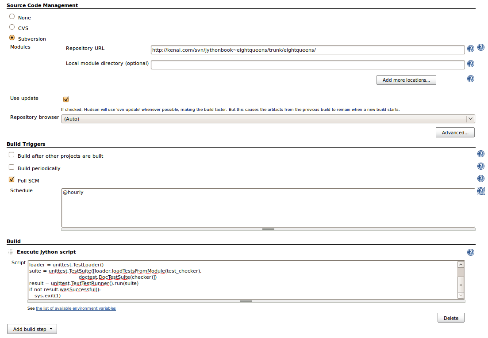
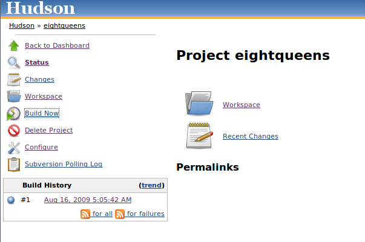
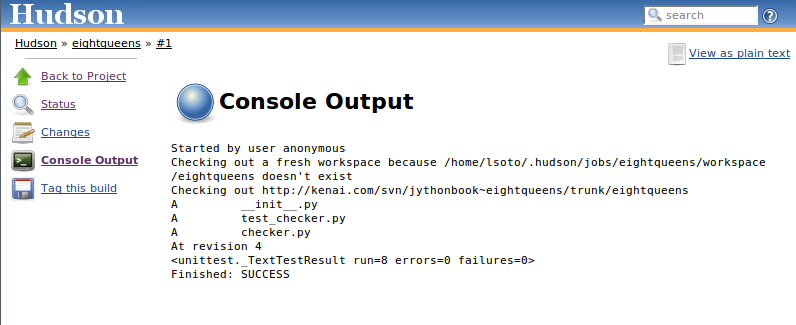

Chapter 19:  Testing and Continuous Integration
+++++++++++++++++++++++++++++++++++++++++++++++

Nowadays, automated testing is a fundamental activity in software
development. In this chapter you will see a survey of the tools available for
Jython is this field, from common tools used in the Python world to aid with
unit testing to more complex tools available in the Java world which can be
extended or driven using Jython.

Python Testing Tools
====================

UnitTest
--------

First we will take a look at the most classic test tool available in Python:
PyUnit. It follows the conventions of most "xUnit" incarnations: You subclass
from ``TestCase`` class, then optionally override the methods ``setup()`` and
``tearDown()`` which are executed around the test methods, which are all the
methods you define with a name starting with "test". And you can use the
multiple ``assert*()`` methods provided by ``TestCase``. Here is an very simple
test case for the some functions of the built-in math module::

    import math
    import unittest
    
    class TestMath(unittest.TestCase):
        def testFloor(self):
            self.assertEqual(1, math.floor(1.01))
            self.assertEqual(0, math.floor(0.5))
            self.assertEqual(-1, math.floor(-0.5))
            self.assertEqual(-2, math.floor(-1.1))
    
        def testCeil(self):
            self.assertEqual(2, math.ceil(1.01))
            self.assertEqual(1, math.ceil(0.5))
            self.assertEqual(0, math.ceil(-0.5))
            self.assertEqual(-1, math.ceil(-1.1))
    
There are many other assertion methods besides ``assertEqual()``, of
course. Here is a list with the rest of the available assertion methods:

* ``assertNotEqual(a, b)``: The opposite of ``assertEqual()``

* ``assertAlmostEqual(a, b)``: Only used for numeric comparison. It adds a sort
  of tolerance for insignificant differences, by subtracting its first two
  arguments after rounding them to the seventh decimal place, and later
  comparing the result to zero. You can specify a different number of decimal
  places in the third argument. This is useful for comparison of floating point
  numbers.

* ``assertNotAlmostEqual(a, b)``: The opposite of ``assertAlmostEqual()``

* ``assert_(x)``: Accepts a boolean argument expecting it to be ``True``. You can
  use it to write other checks like "greater than", or to check boolean
  functions/attributes (The trailing underscore is needed because ``assert`` is
  a keyword).

* ``assertFalse(x)``. The opposite of ``assert_()``.

* ``assertRaises(exception, callable)``. Used to assert that an exception passed
  as the first argument is thrown when invoking the callable specified as the
  second argument. The rest of arguments passed to assertRaises is passed on to
  the callable.

As an example, let's extend our test of mathematical functions using some of
these other assertion functions::

    import math
    import unittest
    import operator
    
    class TestMath(unittest.TestCase):
            
        # ...
    
        def testMultiplication(self):
            self.assertAlmostEqual(0.3, 0.1 * 3)
    
        def testDivision(self):
            self.assertRaises(ZeroDivisionError, operator.div, 1, 0)
            # The same assertion using a different idiom:
            self.assertRaises(ZeroDivisionError, lambda: 1 / 0)
    
Now, you may be wondering how to run this test case. The simple answer is to add
the following to the file in which we defined it::

    if __name__ == '__main__':
        unittest.main()

Finally, just run the module. Say, if you wrote all this code on a file named
``test_math.py``, then run::

    $ jython test_math.py

And you will see this output::

    ....
    ----------------------------------------------------------------------
    Ran 4 tests in 0.005s
    
    OK

Each dot about the dash line represent a successfully ran test. Let see what
happens if we add a test that fails. Change the invocation
``assertAlmostEqual()`` method in ``testMultiplication()`` to use
``assertEqual()`` instead. If you run the module again, you will see the
following output::

    ...F
    ======================================================================
    FAIL: testMultiplication (__main__.TestMath)
    ----------------------------------------------------------------------
    Traceback (most recent call last):
      File "test_math.py", line 22, in testMultiplication
        self.assertEqual(0.3, 0.1 * 3)
    AssertionError: 0.3 != 0.30000000000000004
    
    ----------------------------------------------------------------------
    Ran 4 tests in 0.030s

    FAILED (failures=1)

As you can see, the last dot is now an "F", and an explanation of the failure is
printed, pointing out that ``0.3`` and ``0.30000000000000004`` are not
equal. The last line also shows the grand total of 1 failure.

By the way, now you can imagine why using ``assertEquals(x, y)`` is better than
``assert_(x == y)``: if the test fails, ``assertEquals()`` provides helpful
information, which ``assert_()`` can't possibly provide by itself. To see this
in action, let's change ``testMultiplication()`` to use ``assert_()``::

    class TestMath(unittest.TestCase):
        
        #...

        def testMultiplication(self):
            self.assert_(0.3 == 0.1 * 3)

If you run the test again, the output will be::

    ...F
    ======================================================================
    FAIL: testMultiplication (__main__.TestMath)
    ----------------------------------------------------------------------
    Traceback (most recent call last):
      File "test_math.py", line 24, in testMultiplication
        self.assert_(0.3 == 0.1 * 3)
    AssertionError
    
    ----------------------------------------------------------------------
    Ran 4 tests in 0.054s
    
    FAILED (failures=1)

Now all what we have is the traceback and the "AssertionError" message. No extra
information is provided to help us diagnostic the failure, as it was the case
when we use ``assertEqual()``. That's why all the specialized ``assert*()``
methods are so helpful. Actually, with the exception of ``assertRaises()`` all
assertion methods accept an extra parameter meant to be the debugging message
which will be shown in case the test fails. That lets you write helper methods
like::

    class SomeTestCase(unittest.TestCase):
        def assertGreaterThan(a, b):
	    self.assert_(a > b, '%d isn't greater than %d')

	def testSomething(self):
	    self.assertGreaterThan(10, 4)

As your application gets bigger, the number of test cases will grow
too. Eventually, you may not want to keep all the tests on one python module,
for maintainability reasons.

Let's create a new module, named ``test_lists.py`` with the following test
code::

    import unittest
    
    class TestLists(unittest.TestCase):
        def setUp(self):
            self.list = ['foo', 'bar', 'baz']
    
        def testLen(self):
            self.assertEqual(3, len(self.list))
    
        def testContains(self):
            self.assert_('foo' in self.list)
            self.assert_('bar' in self.list)
            self.assert_('baz' in self.list)
    
        def testSort(self):        
            self.assertNotEqual(['bar', 'baz', 'foo'], self.list)
            self.list.sort()
            self.assertEqual(['bar', 'baz', 'foo'], self.list)
                
.. note:: 

   In the previous code you can see an example on a ``setUp()`` method, which
   allows us to avoid repeating the same initialization code on each ``test*()``
   method.

And, restoring our math tests to a good state, the ``test_math.py`` will contain
the following::
 
    import math
    import unittest
    import operator
    
    class TestMath(unittest.TestCase):
        def testFloor(self):
            self.assertEqual(1, math.floor(1.01))
            self.assertEqual(0, math.floor(0.5))
            self.assertEqual(-1, math.floor(-0.5))
            self.assertEqual(-2, math.floor(-1.1))
    
        def testCeil(self):
            self.assertEqual(2, math.ceil(1.01))
            self.assertEqual(1, math.ceil(0.5))
            self.assertEqual(0, math.ceil(-0.5))
            self.assertEqual(-1, math.ceil(-1.1))
    
        def testDivision(self):
            self.assertRaises(ZeroDivisionError, operator.div, 1, 0)
            # The same assertion using a different idiom:
            self.assertRaises(ZeroDivisionError, lambda: 1 / 0)

        def testMultiplication(self):
            self.assertAlmostEqual(0.3, 0.1 * 3)

Now, how do we run, in one pass, tests defined in different modules? One option
is to manually build a *test suite*. A test suite is a simply collection of test
cases (and/or other test suites) which, when ran, will run all the test cases
(and/or test suites) contained by it. Note that a new test case instance is
built for each test method, so suites have already been build under the hood
every time you have run a test module. Our work, then, is to "paste" the suites
together.

Let's build suites using the interactive interpreter! 

First, import the involved modules:

    >>> import unittest, test_math, test_lists

Then, we will obtain the test suites for each one of our test modules (which
were implicitly created when running them using the ``unittest.main()``
shortcut), using the ``unittest.TestLoader`` class::

    >>> loader = unittest.TestLoader()
    >>> math_suite = loader.loadTestsFromModule(test_math)
    >>> lists_suite = loader.loadTestsFromModule(test_lists)

Now we build a new suite which combine these suites::

    >>> global_suite = unittest.TestSuite([math_suite, lists_suite])

And finally, we run the suite::

    >>> unittest.TextTestRunner().run(global_suite)
    .......
    ----------------------------------------------------------------------
    Ran 7 tests in 0.010s
    
    OK
    <unittest._TextTestResult run=7 errors=0 failures=0>
    
Or, if you feel like wanting a more verbose output::

    >>> unittest.TextTestRunner(verbosity=2).run(global_suite)              
    testCeil (test_math.TestMath) ... ok
    testDivision (test_math.TestMath) ... ok
    testFloor (test_math.TestMath) ... ok
    testMultiplication (test_math.TestMath) ... ok
    testContains (test_lists.TestLists) ... ok
    testLen (test_lists.TestLists) ... ok
    testSort (test_lists.TestLists) ... ok
    
    ----------------------------------------------------------------------
    Ran 7 tests in 0.020s
    
    OK
    <unittest._TextTestResult run=7 errors=0 failures=0>

Using this low level knowledge about loaders, suites and runner you can easily
write a script to run the tests of any project. Obviously, the details of the
script will vary from project to project depending the way in which you decide
to organize your tests. 

On the other hand, typically you won't write custom scripts to run all your
tests. Using test tools which do automatic test discovery will be a much
convenient approach. We will look one of them shortly. But first, I must show
you other testing tool very popular in the Python world: doctests.

Doctests
--------

Doctests are a very ingenious combination of, well, documentation and tests. A
doctest is, in essence, no more than a snapshot of a interactive interpreter
session, mixed with paragraphs of documentation, typically inside of a
docstring. Here is a simple example::

    def is_even(number):
        """
        Checks if an integer number is even. 
        
        >>> is_even(0)
        True
        
        >>> is_even(2)
        True
        
        >>> is_even(3)
        False
    
        It works with very long numbers:
        
        >>> is_even(100000000000000000000000000000)
        True
        
        And also with negatives:
        
        >>> is_even(-1000000000000000000000000000001)
        False
        
        But not with floats:
        
        >>> is_even(4.1)
        Traceback (most recent call last):
        ...
        ValueError: 4.1 isn't an integer
        
        However, a value of type float as long as it value is an integer:
        
        >>> is_even(4.0)
        True
        """
        remainder = number % 2
        if 0 < remainder < 1:
            raise ValueError("%f isn't an integer" % number)
        return remainder == 0

Note that, if we weren't talking about testing, we may have thought that the
docstring of ``is_even()`` is just normal documentation, in which the convention
of using the interpreter prompt to mark examples and output was adopted (also
note also that irrelevant stack trace has been striped of in the exception
example). After all, in many cases we use examples as part of the
documentation. Take a look at Java's ``SimpleDateFormat`` documentation located
in http://java.sun.com/javase/6/docs/api/java/text/SimpleDateFormat.html and you
will spot fragments like:

* "...using a pattern of MM/dd/yy and a SimpleDateFormat instance created on
  Jan 1, 1997, the string 01/11/12 would be interpreted as Jan 11, 2012..."

* "...01/02/3 or 01/02/003 are parsed, using the same pattern, as Jan 2, 3 AD..."

* "..."01/02/-3" is parsed as Jan 2, 4 BC..."

The magic of doctests if that it encourages the inclusion of these examples by
doubling them as tests. Let's save our example code as ``even.py`` and add the
following snippet at the end::

    if __name__ == "__main__":
        import doctest
        doctest.testmod()
    
Then, run it::

    $ jython even.py

And well, doctests are a bit shy and don't show any output on success. But to
convince you that it is indeed testing our code, run it with the ``-v`` option::

    $ jython even.py -v

    Trying:
        is_even(0)
    Expecting:
        True
    ok
    Trying:
        is_even(2)
    Expecting:
        True
    ok
    Trying:
        is_even(3)
    Expecting:
        False
    ok
    Trying:
        is_even(100000000000000000000000000000)
    Expecting:
        True
    ok
    Trying:
        is_even(-1000000000000000000000000000001)
    Expecting:
        False
    ok
    Trying:
        is_even(4.1)
    Expecting:
        Traceback (most recent call last):
        ...
        ValueError: 4.1 isn't an integer
    ok
    Trying:
        is_even(4.0)
    Expecting:
        True
    ok
    1 items had no tests:
        __main__
    1 items passed all tests:
       7 tests in __main__.is_even
    7 tests in 2 items.
    7 passed and 0 failed.
    Test passed.

Doctests are a very, very convenient way to do testing, since the interactive
examples can be directly copy-pasted from the interactive shell, transforming
the manual testing in documentation example and automated tests in one shot. 

You don't really *need* to include doctests as part of the documentation of the
feature they test. Nothing stops you to write the following code in, say, the
``test_math_using_doctest.py`` module::

    """
    Doctests equivalent to test_math unittests seen in the previous section.
    
    >>> import math
    
    Tests for floor():
    
    >>> math.floor(1.01)
    1
    >>> math.floor(0.5)
    0
    >>> math.floor(-0.5)
    -1
    >>> math.floor(-1.1)
    -2
    
    Tests for ceil():
    
    >>> math.ceil(1.01)
    2
    >>> math.ceil(0.5)
    1
    >>> math.ceil(-0.5)
    0
    >>> math.ceil(-1.1)
    -1
    
    Test for division:
    
    >>> 1 / 0
    Traceback (most recent call last):
    ...
    ZeroDivisionError: integer division or modulo by zero
   
    Test for floating point multiplication:
 
    >>> (0.3 - 0.1 * 3) < 0.0000001
    True
    
    """
    if __name__ == "__main__":
        import doctest
        doctest.testmod()
    

One thing to note on the last test in the previous example, is that in some
cases doctests are not the most clean way to express a test. Also note that if
that test fails you will *not* get useful information from the failure. It will
tell you that the output was ``False`` when ``True`` was expected, without the
extra details that ``assertAlmostEquals()`` would give you. The morale of the
history is to realize that doctest is just another tool in the toolbox, which
can fit very well in some cases and not fit well in others.

.. warning::

   Speaking of doctests gotchas: The use of dictionary outputs in doctests is a
   very common error that breaks the portability of your doctests across Python
   implementations (e.g. Jython, CPython and IronPython) . The trap here is that
   *the order of dict keys is implementation-dependent*, so the test may pass
   when working on some implementation and fail horribly on others. The
   workaround is to convert the dict to a sequence of tuples and sort them,
   using ``sorted(mydict.items())``.

   That shows the big downfall of doctests: It always does a textual comparison
   of the expression, converting the result to string. It isn't aware of the
   objects structure.

To take advantage of doctests we have to follow some simple rules, like using
the ``>>>`` prompt and leaving a blank line between sample output and the next
paragraph. But if you think about it, is the same kind of sane rules that makes
the documentation readable by people.

The only common rule not shown by the examples shown in this section is the way
to write expressions which are written in more than one line. As you may expect,
you have to follow the same convention used by the interactive interpreter:
start the continuation lines with an ellipsis: ``...``. For example::

    """    
    Addition is commutative:

    >>> ((1 + 2) ==
    ...  (2 + 1))
    True
    """

A Complete Example
------------------

Having seen the two test frameworks used in the Python world, let's see them
applied to a more meaningful program. We will write code to check for solutions
of the eight-queens chess puzzle. The idea of the puzzle is to place eight
queens in a chessboard, with no queen attacking each other. Queens can attack
any piece placed in the same row, column or diagonals. The figure
:ref:`fig-eightqueens` shows one of the solutions of the puzzle.

.. _fig-eightqueens:

   Eight queens solution

I like to use doctests to check the contract of the program with the outside,
and unittest for what we could see as the internal tests. I do that because
external interfaces tend to be clearly documented, and automated testing of the
examples in the documentation is always a great thing. On the other hand,
unittests shine on pointing us to the very specific source of a bug, or at the
very least on providing more useful debugging information than doctests. 

.. note::

   In practice, both type of tests have strengths and weakness, and you may find
   some cases in which you will prefer the readability and simplicity of
   doctests and only use them on your project. Or you will favor the
   granularity and isolation of unittests and only use them on your project. As
   many things in life, it's a trade-off.

We'll develop this program in a test-driven development fashion. Test will be
written first, as a sort of specification for our program, and code will be
written later to fulfill the tests requirements.

Let's start by specifying the public interface of our puzzle checker, which will
live on the ``eightqueen`` package. This is the start of the main module,
``eightqueen.checker``::

    """
    eightqueen.checker: Validates solutions for the eight queens puzzle.
    
    Provides the function is_solution(board) to determine if a board represents a
    valid solution of the puzzle.
    
    The chess board is represented by list of 8 strings, each string of length
    8. Positions occupied by a Queen are marked by the character 'Q', and empty
    spaces are represented by an space character.
    
    Here is a valid board:
    
    >>> board = ['Q       ',
    ...          ' Q      ',
    ...          '  Q     ',
    ...          '   Q    ',
    ...          '    Q   ',
    ...          '     Q  ',
    ...          '      Q ',
    ...          '       Q']
    
    Naturally, it is not a correct solution:
    
    >>> is_solution(board)
    False
    
    Here is a correct solution:
    
    >>> is_solution(['Q       ',
    ...              '    Q   ',
    ...              '       Q',
    ...              '     Q  ',
    ...              '  Q     ',
    ...              '      Q ',
    ...              ' Q      ',
    ...              '   Q    '])
    True
    
    Malformed boards are rejected and a ValueError is thrown:
    
    >>> is_solution([])
    Traceback (most recent call last):
    ...
    ValueError: Malformed board
    
    Only 8 x 8 boards are supported.
    
    >>> is_solution(['Q   ',
    ...              ' Q  ',
    ...              '  Q ',
    ...              '   Q'])
    Traceback (most recent call last):
    ...
    ValueError: Malformed board
    
    And they must only contains Qs and spaces:
    
    >>> is_solution(['X       ',
    ...              '    X   ',
    ...              '       X',
    ...              '     X  ',
    ...              '  X     ',
    ...              '      X ',
    ...              ' X      ',
    ...              '   X    '])
    Traceback (most recent call last):
    ...
    ValueError: Malformed board
    
    And the total number of Qs must be eight:
    
    >>> is_solution(['QQQQQQQQ',
    ...              'Q       ',
    ...              '        ',
    ...              '        ',
    ...              '        ',
    ...              '        ',
    ...              '        ',
    ...              '        '])
    Traceback (most recent call last):
    ...
    ValueError: There must be exactly 8 queens in the board
    
    >>> is_solution(['QQQQQQQ ',
    ...              '        ',
    ...              '        ',
    ...              '        ',
    ...              '        ',
    ...              '        ',
    ...              '        ',
    ...              '        '])
    Traceback (most recent call last):
    ...
    ValueError: There must be exactly 8 queens in the board
                 
    """
    
That's a good start: we know what we have to build. The doctests play the role
of a more precise problem statement. Actually, it's an executable problem
statement which can be used to verify our solution to the problem.

Now we will specify the "internal" interface which shows how we can solve the
problem of writing the solution checker. It's a common practice to write the
unit tests on a separate module. So here is the code for
``eightqueens.test_checker``::

    import unittest
    from eightqueens import checker
    
    BOARD_TOO_SMALL = ['Q' * 3 for i in range(3)]
    BOARD_TOO_BIG = ['Q' * 10 for i in range(10)]
    BOARD_WITH_TOO_MANY_COLS = ['Q' * 9 for i in range(8)]
    BOARD_WITH_TOO_MANY_ROWS = ['Q' * 8 for i in range(9)]
    BOARD_FULL_OF_QS = ['Q' * 8 for i in range(8)]
    BOARD_FULL_OF_CRAP = [chr(65 + i) * 8 for i in range(8)]
    BOARD_EMPTY = [' ' * 8 for i in range(8)]
    
    BOARD_WITH_QS_IN_THE_SAME_ROW = ['Q   Q   ',
                                     '        ',
                                     '       Q',
                                     '     Q  ',
                                     '  Q     ',
                                     '      Q ',
                                     ' Q      ',
                                     '   Q    ']
    BOARD_WITH_WRONG_SOLUTION = BOARD_WITH_QS_IN_THE_SAME_ROW
    
    BOARD_WITH_QS_IN_THE_SAME_COL = ['Q       ',
                                     '    Q   ',
                                     '       Q',
                                     'Q       ',
                                     '  Q     ',
                                     '      Q ',
                                     ' Q      ',
                                     '   Q    ']
    
    BOARD_WITH_QS_IN_THE_SAME_DIAG_1 = ['        ',
                                        '        ',
                                        '        ',
                                        '        ',
                                        '        ',
                                        '        ',
                                        'Q       ',
                                        ' Q      ']
    
    BOARD_WITH_QS_IN_THE_SAME_DIAG_2 = ['        ',
                                        '   Q    ',
                                        '        ',
                                        '     Q  ',
                                        '        ',
                                        '        ',
                                        '        ',
                                        '        ']
    
    BOARD_WITH_QS_IN_THE_SAME_DIAG_3 = ['        ',
                                        '      Q ',
                                        '        ',
                                        '        ',
                                        '        ',
                                        '  Q     ',
                                        '        ',
                                        '        ']
    
    
    BOARD_WITH_QS_IN_THE_SAME_DIAG_4 = ['        ',
                                        '    Q   ',
                                        '        ',
                                        '        ',
                                        '        ',
                                        'Q       ',
                                        '        ',
                                        '        ']
    
    
    BOARD_WITH_QS_IN_THE_SAME_DIAG_5 = ['       Q',
                                        '      Q ',
                                        '     Q  ',
                                        '    Q   ',
                                        '   Q    ',
                                        '  Q     ',
                                        ' Q      ',
                                        'Q       ']
    
    
    
    BOARD_WITH_SOLUTION = ['Q       ',
                           '    Q   ',
                           '       Q',
                           '     Q  ',
                           '  Q     ',
                           '      Q ',
                           ' Q      ',
                           '   Q    ']
    
    
    class ValidationTest(unittest.TestCase):
        def testValidateShape(self):
            def assertNotValidShape(board):
                self.assertFalse(checker._validate_shape(board))
    
            # Some invalid shapes:
            assertNotValidShape([])
            assertNotValidShape(BOARD_TOO_SMALL)
            assertNotValidShape(BOARD_TOO_BIG)
            assertNotValidShape(BOARD_WITH_TOO_MANY_COLS)
            assertNotValidShape(BOARD_WITH_TOO_MANY_ROWS)
            
            def assertValidShape(board):
                self.assert_(checker._validate_shape(board))
    
            assertValidShape(BOARD_WITH_SOLUTION)
            # Shape validation doesn't care about board contents:
            assertValidShape(BOARD_FULL_OF_QS)        
            assertValidShape(BOARD_FULL_OF_CRAP)
    
        def testValidateContents(self):
            # Valid content => only 'Q' and ' ' in the board
            self.assertFalse(checker._validate_contents(BOARD_FULL_OF_CRAP))
            self.assert_(checker._validate_contents(BOARD_WITH_SOLUTION))
            # Content validation doesn't care about the number of queens:
            self.assert_(checker._validate_contents(BOARD_FULL_OF_QS))
    
    
        def testValidateQueens(self):
            self.assertFalse(checker._validate_queens(BOARD_FULL_OF_QS))
            self.assertFalse(checker._validate_queens(BOARD_EMPTY))
            self.assert_(checker._validate_queens(BOARD_WITH_SOLUTION))
            self.assert_(checker._validate_queens(BOARD_WITH_WRONG_SOLUTION))
            
    
    class PartialSolutionTest(unittest.TestCase):
        def testRowsOK(self):
            self.assert_(checker._rows_ok(BOARD_WITH_SOLUTION))
            self.assertFalse(checker._rows_ok(BOARD_WITH_QS_IN_THE_SAME_ROW))
    
        def testColsOK(self):
            self.assert_(checker._cols_ok(BOARD_WITH_SOLUTION))
            self.assertFalse(checker._cols_ok(BOARD_WITH_QS_IN_THE_SAME_COL))
    
        def testDiagonalsOK(self):
            self.assert_(checker._diagonals_ok(BOARD_WITH_SOLUTION))
            self.assertFalse(
                checker._diagonals_ok(BOARD_WITH_QS_IN_THE_SAME_DIAG_1))
            self.assertFalse(
                checker._diagonals_ok(BOARD_WITH_QS_IN_THE_SAME_DIAG_2))
            self.assertFalse(
                checker._diagonals_ok(BOARD_WITH_QS_IN_THE_SAME_DIAG_3))
            self.assertFalse(
                checker._diagonals_ok(BOARD_WITH_QS_IN_THE_SAME_DIAG_4))
            self.assertFalse(
                checker._diagonals_ok(BOARD_WITH_QS_IN_THE_SAME_DIAG_5))
    
    class SolutionTest(unittest.TestCase):
        def testIsSolution(self):
            self.assert_(checker.is_solution(BOARD_WITH_SOLUTION))
    
            self.assertFalse(checker.is_solution(BOARD_WITH_QS_IN_THE_SAME_COL))
            self.assertFalse(checker.is_solution(BOARD_WITH_QS_IN_THE_SAME_ROW))
            self.assertFalse(checker.is_solution(BOARD_WITH_QS_IN_THE_SAME_DIAG_5))
    
            self.assertRaises(ValueError, checker.is_solution, BOARD_TOO_SMALL)
            self.assertRaises(ValueError, checker.is_solution, BOARD_FULL_OF_CRAP)
            self.assertRaises(ValueError, checker.is_solution, BOARD_EMPTY)
            
        
These unit tests propose a way to solve the problem, decomposing it in two big
tasks (input validation and the actual verification of solutions) and each task
is decomposed on a smaller portion meant to be implemented by a function. In
some way, they are an executable design of the solution.

So we have a mix of doctests and unit tests. How do we run all of them in one
shot? Previously I showed you how to manually compose a test suite for unit
tests belonging to different modules, so that may be an answer. And indeed,
there is a way to add doctests to test suites:
``doctest.DocTestSuite(module_with_doctests)``. But, since we are working on a
more real testing example, we will use a real world solution to this problem (as
you can imagine, people got tired of the tedious work and more automated
solutions appeared).

Nose
----

Nose is a tool for test discovery and execution. By default, nose tries to run
tests on any module whose name starts with "test". You can override that, of
course. In our case, the example code of the previous section followed the
convention (the test module is named ``eightqueens.test_checker``).

.. XXX: I'm duplicating setuptools instructions here, from Chapter 14. We need
..      to rethink in which part of the book we want to introduce setuptools

An easy way to install nose is via setuptools. First, download ez_setup.py from
http://peak.telecommunity.com/dist/ez_setup.py. Then, go to the directory where
you left the downloaded file and execute::

    $ jython ez_setup.py

You will see the following output::

    Downloading http://pypi.python.org/packages/2.5/s/setuptools/setuptools-0.6c9-py2.5.egg
    Processing setuptools-0.6c9-py2.5.egg
    Copying setuptools-0.6c9-py2.5.egg to /home/lsoto/jython2.5.0/Lib/site-packages
    Adding setuptools 0.6c9 to easy-install.pth file
    Installing easy_install script to /home/lsoto/jython2.5.0/bin
    Installing easy_install-2.5 script to /home/lsoto/jython2.5.0/bin
    
    Installed /home/lsoto/jython2.5.0/Lib/site-packages/setuptools-0.6c9-py2.5.egg
    Processing dependencies for setuptools==0.6c9
    Finished processing dependencies for setuptools==0.6c9

(Naturally, the filesystem paths will change, but it will be essentially the
same)

After this, you have setuptools installed, and the ``easy_install`` command
available. Armed with this we proceed to install nose::

    $ easy_install nose
  
.. note::

   I'm assuming that the ``bin`` directory of the Jython installation is on your
   ``PATH``. If it's not, you will have to explicitly type that path preceding
   each command like ``jython`` or ``easy_install`` with that path (i.e., you
   will need to type something like ``/path/to/jython/bin/easy_install`` instead
   of just ``easy_install``)

Once nose is installed, an executable named ``nosetests`` will appear on the
``bin/`` directory of your Jython installation. Let's try it, locating ourselves
on the parent directory of ``eightqueens`` and running::

    $ nosetests --with-doctest

By default nose do *not* run doctests, so we have to explicitly enable the
doctest plugin that comes built in with nose. 

Back to our example, here is the shortened output after running nose::

    FEEEEEE

    [Snipped output]

    ----------------------------------------------------------------------
    Ran 8 tests in 1.133s
    FAILED (errors=7, failures=1)

Of course all of our tests (6 unit tests and 1 doctest) failed. It's time to fix
that. But first, let's run nose again *without* the doctests, since we will
follow the unit tests to construct the solution. And we know that as long as our
unit tests fail, the doctest will also likely fail. Once all unit tests pass, we
can check our whole program against the high level doctest and see if we missed
something or did it right. Here is the nose output for the unit tests::

    $ nosetests
    EEEEEEE
    ======================================================================
    ERROR: testIsSolution (eightqueens.test_checker.SolutionTest)
    ----------------------------------------------------------------------
    Traceback (most recent call last):
      File "/path/to/eightqueens/test_checker.py", line 149, in testIsSolution
        self.assert_(checker.is_solution(BOARD_WITH_SOLUTION))
    AttributeError: 'module' object has no attribute 'is_solution'
    
    ======================================================================
    ERROR: testColsOK (eightqueens.test_checker.PartialSolutionTest)
    ----------------------------------------------------------------------
    Traceback (most recent call last):
      File "/path/to/eightqueens/test_checker.py", line 100, in testColsOK
        self.assert_(checker._cols_ok(BOARD_WITH_SOLUTION))
    AttributeError: 'module' object has no attribute '_cols_ok'
    
    ======================================================================
    ERROR: testDiagonalsOK (eightqueens.test_checker.PartialSolutionTest)
    ----------------------------------------------------------------------
    Traceback (most recent call last):
      File "/path/to/eightqueens/test_checker.py", line 104, in testDiagonalsOK
        self.assert_(checker._diagonals_ok(BOARD_WITH_SOLUTION))
    AttributeError: 'module' object has no attribute '_diagonals_ok'
    
    ======================================================================
    ERROR: testRowsOK (eightqueens.test_checker.PartialSolutionTest)
    ----------------------------------------------------------------------
    Traceback (most recent call last):
      File "/path/to/eightqueens/test_checker.py", line 96, in testRowsOK
        self.assert_(checker._rows_ok(BOARD_WITH_SOLUTION))
    AttributeError: 'module' object has no attribute '_rows_ok'

    ======================================================================
    ERROR: testValidateContents (eightqueens.test_checker.ValidationTest)
    ----------------------------------------------------------------------
    Traceback (most recent call last):
      File "/path/to/eightqueens/test_checker.py", line 81, in testValidateContents
        self.assertFalse(checker._validate_contents(BOARD_FULL_OF_CRAP))
    AttributeError: 'module' object has no attribute '_validate_contents'
    
    ======================================================================
    ERROR: testValidateQueens (eightqueens.test_checker.ValidationTest)
    ----------------------------------------------------------------------
    Traceback (most recent call last):
      File "/path/to/eightqueens/test_checker.py", line 88, in testValidateQueens
        self.assertFalse(checker._validate_queens(BOARD_FULL_OF_QS))
    AttributeError: 'module' object has no attribute '_validate_queens'
    
    ======================================================================
    ERROR: testValidateShape (eightqueens.test_checker.ValidationTest)
    ----------------------------------------------------------------------
    Traceback (most recent call last):
      File "/path/to/eightqueens/test_checker.py", line 65, in testValidateShape
        assertNotValidShape([])
      File "/path/to/eightqueens/test_checker.py", line 62, in assertNotValidShape
        self.assertFalse(checker._validate_shape(board))
    AttributeError: 'module' object has no attribute '_validate_shape'
    
    ----------------------------------------------------------------------
    Ran 7 tests in 0.493s
    
    FAILED (errors=7)

Let's start clearing the failures by coding the validation functions specified
by the ``ValidationTest``. That is, the ``_validate_shape()``,
``_validate_contents()`` and ``validate_queens()`` functions, in the
``eightqueens.checker`` module::

    def _validate_shape(board):
        return (board and
                len(board) == 8 and
                all(len(row) == 8 for row in board))
    
    def _validate_contents(board):
        for row in board:
            for square in row:
                if square not in ('Q', ' '):
                    return False
        return True
    
    def _count_queens(row):
        n = 0
        for square in row:
            if square == 'Q':
                n += 1
        return n
    
    def _validate_queens(board):
        n = 0
        for row in board:
            n += _count_queens(row)
        return n == 8
    
And now run nose again::
    
    $ nosetests

    EEEE...
    ======================================================================
    ERROR: testIsSolution (eightqueens.test_checker.SolutionTest)
    ----------------------------------------------------------------------
    Traceback (most recent call last):
      File "/path/to/eightqueens/test_checker.py", line 149, in testIsSolution
        self.assert_(checker.is_solution(BOARD_WITH_SOLUTION))
    AttributeError: 'module' object has no attribute 'is_solution'

    ======================================================================
    ERROR: testColsOK (eightqueens.test_checker.PartialSolutionTest)
    ----------------------------------------------------------------------
    Traceback (most recent call last):
      File "/path/to/eightqueens/test_checker.py", line 100, in testColsOK
        self.assert_(checker._cols_ok(BOARD_WITH_SOLUTION))
    AttributeError: 'module' object has no attribute '_cols_ok'
    
    ======================================================================
    ERROR: testDiagonalsOK (eightqueens.test_checker.PartialSolutionTest)
    ----------------------------------------------------------------------
    Traceback (most recent call last):
      File "/path/to/eightqueens/test_checker.py", line 104, in testDiagonalsOK
        self.assert_(checker._diagonals_ok(BOARD_WITH_SOLUTION))
    AttributeError: 'module' object has no attribute '_diagonals_ok'
    
    ======================================================================
    ERROR: testRowsOK (eightqueens.test_checker.PartialSolutionTest)
    ----------------------------------------------------------------------
    Traceback (most recent call last):
      File "/path/to/eightqueens/test_checker.py", line 96, in testRowsOK
        self.assert_(checker._rows_ok(BOARD_WITH_SOLUTION))
    AttributeError: 'module' object has no attribute '_rows_ok'
    
    ----------------------------------------------------------------------
    Ran 7 tests in 0.534s
    
    FAILED (errors=4)

We passed all the validation tests! Now we should implement the functions
``_rows_ok()``, ``_cols_ok()`` and ``_diagonals_ok()`` to pass
``PartialSolutionTest``::

    def _scan_ok(board, coordinates):
        queen_already_found = False
        for i, j in coordinates:
            if board[i][j] == 'Q':
                if queen_already_found:
                    return False
                else:
                    queen_already_found = True
        return True
            
    
    def _rows_ok(board):
        for i in range(8):
            if not _scan_ok(board, [(i, j) for j in range(8)]):
                return False
        return True
    
    def _cols_ok(board):
        for j in range(8):
            if not _scan_ok(board, [(i, j) for i in range(8)]):
                return False
        return True
    
    def _diagonals_ok(board):
        for k in range(8):
            # Diagonal: (0, k), (1, k + 1), ..., (7 - k, 7)...
            if not _scan_ok(board, [(i, k + i) for i in range(8 - k)]):
                return False
            # Diagonal: (k, 0), (k + 1, 1), ..., (7, 7 - k)
            if not _scan_ok(board, [(k + j, j) for j in range(8 - k)]):
                return False
    
            # Diagonal: (0, k), (1, k - 1), ..., (k, 0)
            if not _scan_ok(board, [(i, k - i) for i in range(k + 1)]):
                return False        
    
            # Diagonal: (7, k), (6, k - 1), ..., (k, 7)
            if not _scan_ok(board, [(7 - j, k + j) for j in range(8 - k)]):
                return False
        return True
    
Let's try nose again::

    $ nosetests

    ...E...
    ======================================================================
    ERROR: testIsSolution (eightqueens.test_checker.SolutionTest)
    ----------------------------------------------------------------------
    Traceback (most recent call last):
      File "/path/to/eightqueens/test_checker.py", line 149, in testIsSolution
        self.assert_(checker.is_solution(BOARD_WITH_SOLUTION))
    AttributeError: 'module' object has no attribute 'is_solution'

    ----------------------------------------------------------------------
    Ran 7 tests in 0.938s
    
    FAILED (errors=1)

Finally, we have to assemble the pieces together to pass the test for
``is_solution()``::

    def is_solution(board):
        if not _validate_shape(board) or not _validate_contents(board):
            raise ValueError("Malformed board")
        if not _validate_queens(board):
            raise ValueError("There must be exactly 8 queens in the board")
        return _rows_ok(board) and _cols_ok(board) and _diagonals_ok(board)
    
And we can hope that all test pass now::

    $ nosetests

    .......
    ----------------------------------------------------------------------
    Ran 7 tests in 0.592s
    
    OK

Indeed, they all pass. Moreover, we probably also pass the "problem statement",
test, expressed in our doctest::

    $ nosetests --with-doctest

    ........
    ----------------------------------------------------------------------
    Ran 8 tests in 1.523s
    
    OK

Objective accomplished! We have come up with a nicely documented and tested
module, using the two testing tools shipped with the Python language, and Nose
to run all our tests without manually building suites.

Integration with Java?
----------------------

You may be wondering how to integrate the testing frameworks of Python and
Java. It is possible to write JUnit tests in Jython, but it's not really
interesting, considering that you can test Java classes using unittest and
doctest. The following is a perfectly valid doctest::

    """
    Tests for Java's DecimalFormat
    
    >>> from java.text import DecimalFormat
    
    A format for money:
    
    >>> dolarFormat = DecimalFormat("$ ###,###.##")
    
    The decimal part is only printed if needed:
        
    >>> dolarFormat.format(1000)    
    u'$ 1.000'
    
    Rounding is used when there are more decimal numbers than those defined by the
    format:
    
    >>> dolarFormat.format(123456.789)
    u'$ 123.456,79'
    
    The format can be used as a parser:
    
    >>> dolarFormat.parse('$ 123')
    123L
    
    The parser ignores the unparseable text after the number:
    
    >>> dolarFormat.parse("$ 123abcd")
    123L
    
    However, if it can't parse a number, it throws a ParseException:
    
    >>> dolarFormat.parse("abcd")
    Traceback (most recent call last):
    ...
    ParseException: java.text.ParseException: Unparseable number: "abcd"
    """

So you can use all what you learned on this chapter to test code written in
Java. Personally, I find this a very powerful tool for Java development: easy,
flexible and unceremonious testing using Jython and Python testing tools!

Continuous Integration
======================

Martin Fowler defines Continuous Integration as "a software development practice
where members of a team integrate their work frequently [...]. Each integration
is verified by an automated build (including test) to detect integration errors
as quickly as possible". Some software development teams report to have used
this practice as early as in the 1960, however it only became mainstream when
advocated as part of the Extreme Programming practices. Nowadays, it is a widely
applied practice, and in the Java world there is a wealth of tools to help with
the technical challenge involved by it.

Getting Hudson
--------------

One tool that currently has a lot of momentum, growing a important user base is
Hudson. Among its prominent features are the ease of installation and
configuration, and the ease to deploy it in a distributed, master/slaves
environment for cross-platform testing. 

But, in my opinion, Hudson's main strength is its highly modular, plugin-based
architecture, which has resulted in the creation of plugins to support most of
the version control, build and reporting tools, and many languages. One of them
is the Jython plugin, which allows you to use the Python language to drive your
builds.

You can find a more details about the Hudson project on its homepage at
https://hudson.dev.java.net/. I will go to the point and show how to test Jython
applications using it.

Grab the latest version of Hudson from
http://hudson-ci.org/latest/hudson.war. Running it is a matter of doing::

 $ java -jar hudson.war

After a few seconds, you will see some logging output on the console, and Hudson
will be up and running. If you visit http://localhost:8080/ you will get a
welcome page inviting you to start using Hudson creating new jobs. 
.. warning::

   Be careful: The default mode of operation of Hudson fully trusts its users,
   letting them to execute any command they want on the server, with the
   privileges of the user running Hudson. You can set stricter access control
   policies on the "Configure System" section of the "Manage Hudson" page.

Installing the Jython Plugin
-----------------------------

Before creating jobs, we will install the Jython plugin. Click on the "Manage
Hudson" link on the left side menu. Then click "Manage Plugins". Now go to the
"Available" tab. You will see a very long list of plugins (I told you this was
the greatest Hudson strength!). Find the "Jython Plugin", click on the checkbox
at its left, as shown on the figure :ref:`fig-hudson-selectingjythonplugin` then
scroll to the end of the page and click the "Install" button.

.. _fig-hudson-selectingjythonplugin:

 
   Selecting the Jython Plugin.

You will see a bar showing the progress of the download and installation
progress, and after little while you will be presented with an screen like shown
on the figure :ref:`fig-hudson-jythonplugininstalled` notifying you that the
process finished. Press the "Restart" button, wait a little bit and you will see
the welcome screen again. Congratulations, you now have a Jython-powered Hudson!

.. _fig-hudson-jythonplugininstalled:

   Jython Plugin Successfully Installed

Creating a Hudson Job for a Jython Project
------------------------------------------

Let's follow now the suggestion of the welcome screen and click the "create new
job" link. A job roughly corresponds to the instructions needed by Hudson to
build a project. It includes:

 * The location from where the source code of the project should be obtained,
   and how often.
 * How to start the build process for the project
 * How to collect information after the build process has finished

After clicking the "create new job" link (equivalent to the "New Job" entry on
the left side menu) you will be asked for a name and type for the Job. We will
use the eightqueens project built on the previous section, so name the project
"eightqueens", select the "Build a free-style software project" option and press
the "OK" button.

In the next screen, we need to setup an option on the "Source Code Management"
section. You may want to experiment with your own repositories here (by default
only CVS and Subversion are supported, but there are plugins for all the other
VCSs in use out there). For our example, I've hosted the code on a Subversion
repository at http://kenai.com/svn/jythonbook~eightqueens/. So select
"Subversion" and enter
http://kenai.com/svn/jythonbook~eightqueens/trunk/eightqueens/ as the
"Repository URL".

.. note::

    Using the public repository will be enough to get a feeling of Hudson and
    its support of Jython.  However, I encourage you to create your own
    repository so you can play freely with continuous integration, for example
    committing bad code to see how failures are handled.

In the "Build Triggers" section we have to specify when automated builds will
happen. We will poll the repository so that a new build will be started after
any change. Select "Poll SCM" and enter "@hourly" on the "Schedule" box (If you
want to know all the options for the schedule, click the help icon at the right
of the box).

In the "Build" section we must tell Hudson how to build our project. By default
Hudson supports Shell scripts (on Unix-like systems, or Windows systems with
Cygwin installed), Batch files (on Windows systems) and Ant scripts as build
steps. For projects in which you mix Java and Python code and drive the build
process with an ant file, the default Ant build step will suffice. In our case,
we wrote our app in pure Python code, so we will use the Jython plugin which
adds the "Execute Jython script" build step.

So click on "Add Build Step" and then select "Execute Jython script". We will
use our knowledge of test suites gained on the `UnitTest`_ section, the
following script will be enough to run our tests::
   
    import os, sys, unittest, doctest
    from eightqueens import checker, test_checker
    
    loader = unittest.TestLoader()
    suite = unittest.TestSuite([loader.loadTestsFromModule(test_checker),
                                doctest.DocTestSuite(checker)])
    result = unittest.TextTestRunner().run(suite)
    print result
    if not result.wasSuccessful():
       sys.exit(1)
           

The figure :ref:`fig-hudson-jobconfig` shows how the page looks so far for the
"Source Code Management", "Build Triggers" and "Build" sections.

.. _fig-hudson-jobconfig:

   Hudson Job Configuration

The next section, titled "Post-build Actions" let you specify action to carry
once the build has finished, ranging from collecting results from reports
generated by static-analysis tools or test runners to send emails notifying
someone of build breakage. We will left these options blank by now. Click the
"Save" button at the bottom of the page.

At this point Hudson will show the job's main page. But it won't contain
anything useful, since Hudson is waiting for the hourly trigger to poll the
repository and kick the build. But we don't need to wait if we don't want to:
just click the "Build Now" link on the left-side menu. Shortly, a new entry will
be shown on the "Build History" box (also on the left side, below the menu), as
shown in the figure :ref:`fig-hudson-buildhistory`.

.. XXX: Actually, the current Jython plugin doesn't work exactly as described
.. here, because it doesn't ship the standard library. But I expect the issues
.. found will be fixed soon

.. _fig-hudson-buildhistory:

   The First Build of our First Job.

If you click on the link that just appeared there you will be directed to the
page for the build we just made. If you click on the "Console Output" link on
the left side menu you will see what's shown in the figure
:ref:`fig-hudson-buildresult`.

.. _fig-hudson-buildresult:

   Console Output for the Build

As you would expect, it shows that our eight tests (remember that we had seven
unit tests and the module doctest) all passed.

